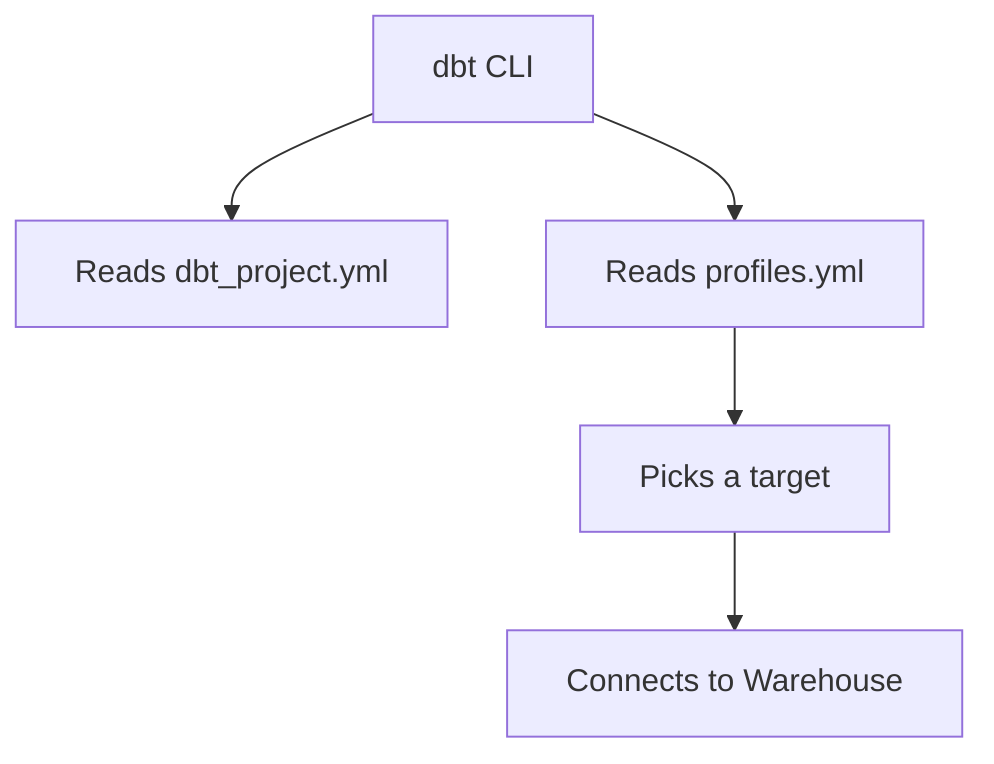
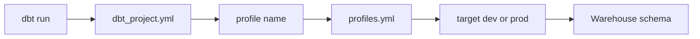

# dbt Projects, Profiles & Targets

*Part of [[dbt-data-build-tool-moc|dbt (Data Build Tool)]] · [[data-pipelines-moc|Data Pipelines]]*

← Prev: [[what-dbt-is-the-t-in-elt|What dbt Is & the T in ELT]] · Next: [[models-the-ref-function|Models & the ref() Function]] →

---

## Recap — where we just were

In [[what-dbt-is-the-t-in-elt|What dbt Is & the T in ELT]] you saw that dbt owns the **T** (Transform) step: it turns raw tables into clean ones using SQL. Now we set up a real dbt project so you can actually run it.

---

## Level 1 — The big idea

A **dbt project** is just a folder. It holds your SQL files and the settings that tell dbt how to behave.

Two files do most of the work:

- **dbt_project.yml** — the *blueprint*. It says *what to build* and how (the project name, version, where models live, default settings).
- **profiles.yml** — the *set of keys*. It says *which warehouse* to connect to (a **data warehouse** is the database where your tables get built), plus the username, password, and **schema** (a named folder of tables inside the warehouse).

A **target** is one named connection inside profiles.yml — like a single key on the keychain. You might have a `dev` key and a `prod` key.

Analogy: the blueprint tells the crew what building to make. The keychain holds keys to different buildings. The target is which key you grab today.



---

## Level 2 — How it actually works

When you type a dbt command, dbt runs through these steps.

1. **Find the project.** dbt looks in the current folder for `dbt_project.yml`. That file names the project and points to a `profile:`.
2. **Find the profile.** dbt opens `profiles.yml` and finds the profile whose name matches the `profile:` key. The name in the project must match the name in profiles, or dbt errors out.
3. **Pick a target.** Each profile lists one or more targets and a default. You can override the default with `--target`.
4. **Connect.** dbt uses that target's settings (warehouse, user, password, schema) to log in.
5. **Build.** dbt compiles your SQL and writes tables into the chosen schema.

Where do these files live? `dbt_project.yml` sits *inside* the project, and you commit it to git. By default `profiles.yml` lives *outside* the project, usually at `~/.dbt/profiles.yml`. That keeps passwords out of your code repository.

A dbt project also has standard subfolders, set up by `dbt init`:

- `models/` — your SQL transformations
- `seeds/` — small CSV files loaded as tables
- `snapshots/` — history tracking
- `tests/` — data checks
- `macros/` — reusable SQL functions
- `analyses/` — one-off queries

To test that your connection works before building anything, run `dbt debug`. It checks that the profile is found and that dbt can log into the warehouse.



---

## Level 3 — See it with real numbers

Here is a minimal `dbt_project.yml`. It lives inside the project and is committed to git.

```yaml
name: 'jaffle_shop'
version: '1.0.0'
profile: 'jaffle_shop'

models:
  jaffle_shop:
    +materialized: view
```

The `profile:` value is `jaffle_shop`, so dbt will look for a profile with that exact name.

Here is `profiles.yml`. It lives at `~/.dbt/profiles.yml`, *outside* the repo, and is NOT committed. Notice it has two targets.

```yaml
jaffle_shop:
  target: dev
  outputs:
    dev:
      type: postgres
      host: localhost
      user: alice
      password: "{{ env_var('DBT_PASSWORD') }}"
      dbname: warehouse
      schema: dbt_dev
    prod:
      type: postgres
      host: localhost
      user: ci_runner
      password: "{{ env_var('DBT_PASSWORD') }}"
      dbname: warehouse
      schema: analytics
```

The password is not written in plain text. `env_var` reads it from an **environment variable** (a value set in your shell, like `DBT_PASSWORD`), so the secret stays out of the file.

The default target is `dev`. So this command:

```bash
dbt run
```

builds your tables into the **dbt_dev** schema. Your work stays in your own space.

Now run the same models but point at production:

```bash
dbt run --target prod
```

What changed? Only the target. Same SQL, same models. But now dbt connects as user `ci_runner` and writes into the **analytics** schema instead of **dbt_dev**. One flag moved the output from your private sandbox to the shared production schema.

---

## Level 4 — In the real world & common traps

**Named use case: personal dev schemas.** On a team, each developer gets their own dev schema. Alice's profile uses `schema: dbt_alice`, Bob's uses `schema: dbt_bob`. They run the same project code, but their built tables land in separate schemas. Nobody overwrites anyone else, and nobody touches the shared `analytics` schema by accident. Production is only written when someone runs with `--target prod`, usually from an automated server.

**People think: "Credentials go in dbt_project.yml."**
Actually: no. `dbt_project.yml` is committed to git, so a password there would leak to everyone with repo access. Connection details and secrets go in **profiles.yml**, which lives outside the repo.

**People think: "profiles.yml gets committed to git like everything else."**
Actually: no. It holds passwords. You keep it out of the repo and pull secrets from environment variables. Committing it would expose your warehouse login. See [[version-control-with-git|Version Control with Git]] for why secrets must never enter history.

**People think: "Everyone on the team shares one schema."**
Actually: that causes chaos — two people building the same table at once clobber each other. Separate dev schemas isolate each person's work.

---

## Level 5 — Expert view

The three pieces have different jobs, live in different places, and have different rules about git.

| Piece | What it controls | Where it lives | In git? |
| --- | --- | --- | --- |
| dbt_project.yml | Project name, paths, default build settings | Inside the project | Yes |
| profiles.yml | Warehouse connection \| user \| password \| schema | Outside, in `~/.dbt/` | No |
| target | Which connection is active right now | A named block inside profiles.yml | No |

The core trade-off is **convenience vs security**. Committing all config to git is convenient — one clone and everything works. But connection files hold secrets, and git keeps history forever, so a leaked password stays leaked. dbt splits the difference: safe-to-share config (the blueprint) goes in git; secrets (the keys) stay out and come from environment variables. This is the same discipline you practice in [[version-control-with-git|Version Control with Git]] — never commit credentials.

---

## Check yourself

**Memory hook:** *Blueprint in git, keys outside, target is the key you pick today.*

**Q1: Where does a warehouse password belong, and why not in dbt_project.yml?**
A: In profiles.yml, outside the repo, ideally from an environment variable. dbt_project.yml is committed to git, so a password there would leak.

**Q2: You run `dbt run` then `dbt run --target prod`. What is the difference?**
A: The first uses the default target (`dev`) and writes to your dev schema. The second uses the `prod` target and writes to the `analytics` schema, with prod credentials. Same SQL, different destination.

**Q3: Why does each developer use a different schema like dbt_alice or dbt_bob?**
A: So their built tables stay separate. They never overwrite each other's work or the shared production schema.

---

## Connects to

[[what-dbt-is-the-t-in-elt|What dbt Is & the T in ELT]] · [[version-control-with-git|Version Control with Git]] · [[models-the-ref-function|Models & the ref() Function]]

---

## Coming up next

Now that your project connects to a warehouse, you need something to build. The next lesson, [[models-the-ref-function|Models & the ref() Function]], shows how a single SQL file becomes a table, and how `ref()` lets one model depend on another so dbt can build them in the right order.
