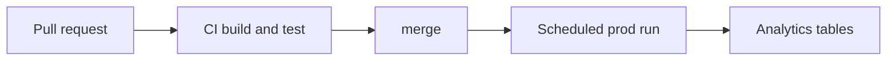
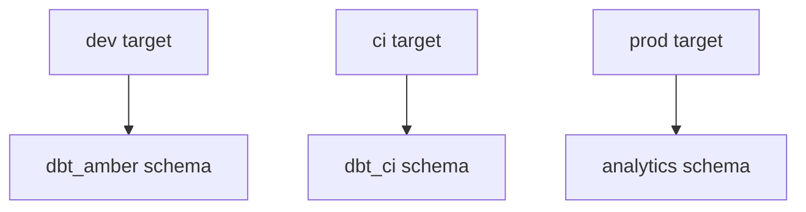

# Deployment, Environments & CI

*Part of [[dbt-data-build-tool-moc|dbt (Data Build Tool)]] · [[data-pipelines-moc|Data Pipelines]]*

← Prev: [[the-dbt-build-workflow|The dbt build Workflow]]

---

## Recap — where we just were

In [[the-dbt-build-workflow|The dbt build Workflow]] you learned to run `dbt build`: one command that builds your models and runs your tests in the right order. On your laptop, that gives you a fully built, fully tested project.

But your laptop is not where the business reads its dashboards. The last step is running the project **safely in production** and **guarding it** every time someone changes the code. That is what this lesson covers.

---

## Level 1 — The big idea

**Deploying dbt does not mean copying files to a server.** dbt is not a website. Deploying dbt means *running* dbt against your real, shared warehouse on a schedule. The deliverable is the freshly built, freshly tested tables sitting in the warehouse — not the code files.

Two ideas work together:

- **Environments.** You keep separate spaces for different jobs. **Dev** (development) is where you experiment. **Prod** (production) is the trusted space that dashboards read.
- **CI** (Continuous Integration) is an automated check that runs every time someone proposes a change, so a broken model is caught *before* it reaches prod.

A kitchen analogy:

- **Dev** is your kitchen at home, where you experiment with a recipe.
- **CI** is the health inspector tasting a new recipe before it is allowed on the menu.
- **Prod** is the restaurant, serving customers on a fixed schedule.



A change flows left to right. It only reaches the analytics tables after it passes the inspector.

---

## Level 2 — How it actually works

The trick is **targets**. From [[dbt-projects-profiles-targets|dbt Projects, Profiles & Targets]], a target tells dbt *which database and which schema to write into*. You use different targets to keep environments apart.

- The **dev** target writes to a personal schema, like `dbt_amber`. Each developer gets their own. You run it manually while building.
- The **CI** target writes to a throwaway schema, like `dbt_ci_pr_42`. It is created fresh for one pull request and deleted after.
- The **prod** target writes to the shared `analytics` schema. Dashboards read only from here. It runs on a schedule, not by hand.

**Rule: never let dev and prod share a schema.** If they did, your half-finished experiments would overwrite the tables the business trusts.



Who actually runs the scheduled prod job? Two common choices:

- **dbt Cloud** — a managed service with a built-in scheduler. You define a job and a time, it runs dbt for you.
- An **external orchestrator** like **Airflow** or **Dagster** (see [[dags-schedulers|DAGs & Schedulers]]) that triggers `dbt build` as one step in a larger pipeline.

The CI check, meanwhile, is wired to your pull request system (see [[code-review-pull-requests|Code Review & Pull Requests]] and [[version-control-with-git|Version Control with Git]]). When you open a pull request, the CI job runs `dbt build` against the temporary CI schema. If a model fails to build or a test fails, the pull request is blocked. This is the same testing discipline as [[automated-testing|Automated Testing]], applied to your warehouse.

---

## Level 3 — See it with real numbers

**(a) The scheduled prod job.** Conceptually, the orchestrator runs this every day at 06:00, so fresh tables are ready before people arrive:

```bash
# Runs daily at 06:00 against the shared analytics schema
dbt build --target prod
```

`--target prod` selects the prod target, so the output lands in the `analytics` schema. `build` runs every model and test in dependency order.

**(b) Slim CI.** Running the whole project on every pull request is slow and wasteful. **Slim CI** runs only the models that changed, plus everything downstream of them. It uses **state comparison** (`state:modified+`) and **deferral** (`--defer`), which lets unchanged upstream models point at the already-built prod tables instead of rebuilding them.

```yaml
# CI job, triggered on every pull request
steps:
  - name: Slim CI build
    run: dbt build --select state:modified+ --defer
```

The `+` after `state:modified` means "and everything downstream." `--defer` says "for anything I did not build, reuse the prod version."

Now the numbers. Imagine a project of **200 models**. A pull request changes **3 models**. Those 3 changes affect **5 downstream models** that depend on them.

| What runs | Model count |
|---|---|
| Full build (no slim CI) | 200 |
| Changed models | 3 |
| Downstream models | 5 |
| Slim CI total | **3 + 5 = 8** |

Slim CI builds **8 models instead of 200** — 192 fewer. The check finishes in a fraction of the time, so reviewers get feedback fast.

---

## Level 4 — In the real world & common traps

**Named use case: an analytics-engineering team.** They run a **nightly prod refresh** at 06:00 and a **CI check on every pull request**. One day an engineer edits a model and breaks a `not_null` test. CI runs `dbt build` against the CI schema, the test fails, and the pull request is blocked. The bug never reaches prod. The morning dashboards stay correct, because the breakage was caught by the inspector, not by an executive at 9 a.m.

**People think: "Deploying dbt means uploading files to a server."**
Actually: you do not upload files. You *run* dbt against the prod target. The artifact is the set of built, tested tables in the warehouse — the code just describes how to make them.

**People think: "CI is unnecessary for SQL because it is not real code."**
Actually: SQL bugs break prod just like any other bug. A wrong join can silently double every revenue number. CI catches these before merge, exactly as in [[automated-testing|Automated Testing]].

**People think: "Dev and prod can safely share one schema."**
Actually: no. Isolate them. If they share a schema, an unfinished dev experiment can overwrite a table the business depends on, and a dashboard goes blank mid-meeting.

---

## Level 5 — Expert view

The three environments, side by side:

| Environment | Who runs it | When | Schema | Purpose |
|---|---|---|---|---|
| Dev | Each developer | Manually, by hand | Personal, e.g. `dbt_amber` | Experiment and build |
| CI | Automation, on a PR | On every pull request | Throwaway, e.g. `dbt_ci_pr_42` | Verify a change before merge |
| Prod | Scheduler | On a fixed schedule | Shared `analytics` | Serve trusted tables |

How you run the scheduled prod job:

| Option | Strength | Trade-off |
|---|---|---|
| dbt Cloud | Built-in scheduler, low setup | Less control; another paid service |
| External orchestrator | Fits dbt into a bigger pipeline | More to build and maintain |

Use an external orchestrator (Airflow or Dagster, see [[dags-schedulers|DAGs & Schedulers]]) when dbt is one step among many — for example, load raw data first, *then* run dbt, *then* refresh a dashboard cache.

CI sits on top of [[code-review-pull-requests|Code Review & Pull Requests]] and [[version-control-with-git|Version Control with Git]]: it only makes sense because changes arrive as pull requests on branches.

**The core trade-off:** more environments and a CI pipeline cost real setup effort. But that effort is small compared to one production incident — a wrong number in a board report, or a blank dashboard during a launch. You pay a little up front to avoid paying a lot later.

---

## Check yourself

**Memory hook:** *Dev is your kitchen, CI is the inspector, prod is the restaurant — and deploying means cooking on a schedule, not mailing the recipe.*

**Q1: What is the actual deliverable when you "deploy" dbt?**
A: The freshly built, tested tables in the production warehouse. You run dbt against the prod target on a schedule; you do not copy files to a server.

**Q2: A project has 200 models. A PR changes 3 models with 5 downstream. How many does slim CI build, and why is that good?**
A: 3 + 5 = 8 models, instead of all 200. Slim CI uses `state:modified+` and `--defer` to skip unchanged models, so the PR check is fast.

**Q3: Why must dev and prod use different schemas?**
A: So unfinished dev work can never overwrite the trusted tables that dashboards read. Sharing a schema risks corrupting prod.

---

## Connects to

- [[code-review-pull-requests|Code Review & Pull Requests]] — CI runs on the pull requests this describes.
- [[version-control-with-git|Version Control with Git]] — branches and PRs are what CI checks.
- [[dags-schedulers|DAGs & Schedulers]] — orchestrators that trigger the prod run.
- [[the-dbt-build-workflow|The dbt build Workflow]] — the `dbt build` command both prod and CI run.

---

## Coming up next

You did it — this is the **final lesson of the dbt course**. You can now build a project, structure it, test it, document it, and deploy it safely with environments and CI.

Head back to the roadmap [[dbt-data-build-tool-moc|dbt (Data Build Tool)]] to review anything that is still fuzzy. Then connect what you learned to the wider vault: the tables dbt builds usually form a [[star-schema|Star Schema]], and the prod job that runs them lives inside the world of [[dags-schedulers|DAGs & Schedulers]]. Well done.
