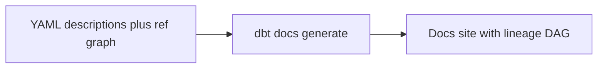
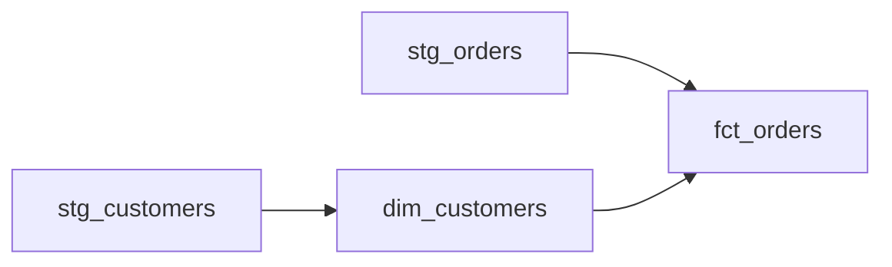

# Documentation & Lineage

*Part of [[dbt-data-build-tool-moc|dbt (Data Build Tool)]] · [[data-pipelines-moc|Data Pipelines]]*

← Prev: [[tests|Tests]] · Next: [[the-dbt-build-workflow|The dbt build Workflow]] →

## Recap — where we just were

In [[tests|Tests]] you learned to prove your data is correct. A test fails loudly when a key is duplicated or a value goes missing. That keeps the data trustworthy.

But correct is not the same as understandable. A new teammate opens your project and sees forty tables. Which one holds revenue? Where did `dim_customers` come from? Correct data nobody can read is still a wall.

This lesson fixes that. You will describe your work in plain language, and let dbt draw a map of how every table connects.

---

## Level 1 — The big idea

**Documentation** means written explanations of what each table and column is. **Lineage** means a picture of how tables depend on each other, from raw source to final report.

Here is the magic part. You write short descriptions in YAML. dbt already knows the dependencies because you used `ref()` and `source()` in your models. From both, dbt builds a small website.

Think of a museum. **Documentation** is the plaque next to each exhibit telling you what it is. **Lineage** is the map showing how you walked from the entrance to that exhibit. And this map redraws itself whenever the building changes.



You write the words once. dbt handles the map for free.

---

## Level 2 — How it actually works

Two pieces feed the docs site.

First, **descriptions**. In a YAML file you add a `description` field to each model and column. For longer prose you can write a **doc block** — a `docs` / `enddocs` Jinja block kept in a `.md` file — and point to it from the YAML. This keeps long text out of the YAML and reusable.

Second, **lineage**. dbt does not need you to draw this. Every time a model calls [[models-the-ref-function|Models & the ref() Function]] or [[sources-the-source-function|Sources & the source() Function]], dbt records a dependency. Those recorded links form a graph.

That graph is a **DAG** — a directed acyclic graph. You met this shape in [[dags-schedulers|DAGs & Schedulers]]. There it showed task run order. Here it shows DATA dependencies: which table is built from which.



Read it from left to right. Raw staging tables flow into dimensions and facts. The arrows are the `ref()` calls you already wrote.

Two commands turn this into a site:

- `dbt docs generate` reads your YAML plus the project's compiled metadata and builds a static website.
- `dbt docs serve` serves that website on your own machine so you can click through it.

The site lists every model, its columns, your descriptions, its tests, and its source — plus the clickable lineage graph.

---

## Level 3 — See it with real numbers

Start with a YAML file. By convention it lives next to your models, often called `schema.yml`.

```yaml
version: 2

models:
  - name: fct_orders
    description: "One row per completed order with its total amount."
    columns:
      - name: order_id
        description: "Primary key. Unique id for each order."
      - name: amount_usd
        description: "Order total in US dollars after discounts."
```

Now generate the site:

```bash
dbt docs generate
dbt docs serve
```

dbt opens a browser. You click `fct_orders` and see your two descriptions, its tests, and the lineage graph.

Let us count that graph exactly. Four models exist:

1. `stg_orders`
2. `stg_customers`
3. `dim_customers`
4. `fct_orders`

The edges (the arrows, each one a dependency) are:

- `stg_orders` → `fct_orders`
- `stg_customers` → `dim_customers`
- `dim_customers` → `fct_orders`

That is **4 nodes** and **3 edges**. Check the arithmetic: 3 distinct arrows, no arrow repeated, none pointing backward. The graph stays acyclic — nothing depends on itself.

Notice `fct_orders` has two arrows coming in (from `stg_orders` and from `dim_customers`). A node can have many parents. That is normal for a fact table that joins several inputs.

---

## Level 4 — In the real world & common traps

**Named use case: onboarding and impact analysis.**

A new analyst joins on Monday. Instead of asking five people what `dim_customers` means, they open the docs site, read your description, and self-serve the answer. That is onboarding.

Later you want to drop a column. You ask: if I remove it, which downstream marts break? You open the lineage graph, follow the arrows out of that table, and see every table that depends on it. That is impact analysis — and the graph gives you the answer in seconds.

**People think: "Documentation is manual and always goes stale."**
Actually: the column lists and the lineage are auto-generated from your code, so they stay current. You only write the prose descriptions. The structure maintains itself.

**People think: "The lineage graph is the same as the orchestrator's schedule DAG."**
Actually: they share a shape, but they mean different things. dbt lineage shows DATA dependencies — which table is built from which. The scheduler DAG in [[dags-schedulers|DAGs & Schedulers]] shows TASK run order — what runs when. Similar picture, different meaning.

**People think: "The docs site is a live database I can query."**
Actually: no. It is a static website describing your project. It tells you about your data; it does not hold your data.

---

## Level 5 — Expert view

The two DAGs look alike, so experts keep their meanings straight.

| Aspect | dbt lineage DAG | Orchestration DAG |
| --- | --- | --- |
| Nodes are | Tables and models | Tasks or jobs to run |
| Edges mean | A table is built from another | A task must finish before the next starts |
| Who builds it | dbt, from `ref()` and `source()` | You, by declaring task order |
| Updates how | Auto, from code | Manually, when you edit the schedule |
| Answers | Where did this data come from | What runs when |

The trade-off is small and worth naming. Writing good descriptions takes real effort, and nobody auto-writes them for you — vague descriptions help no one. But the expensive part, the structure and the lineage, is free because it falls out of code you already wrote.

This ties to [[code-review-pull-requests|Code Review & Pull Requests]]. A reviewer who can open the lineage graph understands a change faster. Shared understanding is the whole point: docs and lineage turn one person's knowledge into the team's knowledge.

---

## Check yourself

**Memory hook:** *Descriptions are the plaque; lineage is the self-redrawing map.*

**Q1: Where do the descriptions and where do the dependencies come from?**
A: Descriptions you write by hand in YAML (or in a doc block). Dependencies dbt derives automatically from your `ref()` and `source()` calls.

**Q2: A graph has nodes stg_orders, stg_customers, dim_customers, fct_orders, with edges stg_orders→fct_orders, stg_customers→dim_customers, dim_customers→fct_orders. How many nodes and edges?**
A: 4 nodes and 3 edges. `fct_orders` has two incoming arrows.

**Q3: Why does dbt lineage stay current while a hand-drawn diagram rots?**
A: Lineage is generated from code each time you run `dbt docs generate`. A hand-drawn diagram only changes when someone remembers to update it.

---

## Connects to

- [[dags-schedulers|DAGs & Schedulers]] — same DAG shape, but task order instead of data dependencies.
- [[models-the-ref-function|Models & the ref() Function]] — every `ref()` becomes a lineage edge.
- [[code-review-pull-requests|Code Review & Pull Requests]] — lineage gives reviewers shared understanding.

---

## Coming up next

You can now build models, test them, and document them. Next you will tie it all together in [[the-dbt-build-workflow|The dbt build Workflow]] — the single command that runs your project in the right order.
