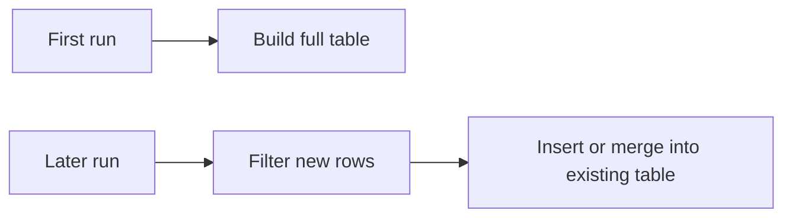
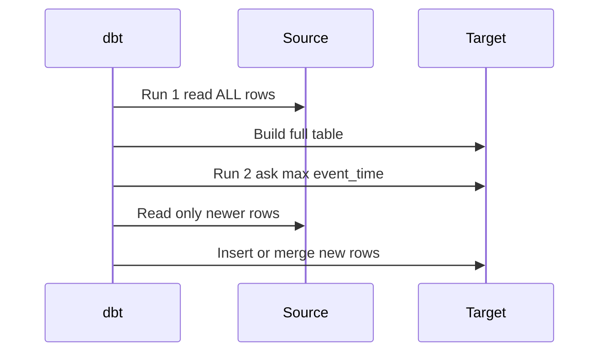

# Incremental Models

*Part of [[dbt-data-build-tool-moc|dbt (Data Build Tool)]] · [[data-pipelines-moc|Data Pipelines]]*

← Prev: [[materializations|Materializations]] · Next: [[project-structure-staging-intermediate-marts|Project Structure: Staging, Intermediate & Marts]] →

---

## Recap — where we just were

In [[materializations|Materializations]] you saw the three main ways dbt stores a model: a **view** (just saved SQL, recomputed on read), a **table** (results saved to disk, rebuilt fully every run), and **ephemeral** (inlined into other models).

The table option has a hidden cost. A **full rebuild** means dbt drops the old table and recomputes every row from scratch, every single run. For a small table that is fine. For an events table with hundreds of millions of rows, rebuilding the whole thing every night is slow and wasteful — you reprocess years of old data just to add today's.

Incremental models fix exactly this.

---

## Level 1 — The big idea

An **incremental model** is a table that dbt builds once in full, then keeps up to date by adding only the new rows each run instead of rebuilding everything.

Think of a diary. A full rebuild is like recopying the entire diary from page one every night just to record today. An incremental model just adds today's page. If you wrote something wrong yesterday, you can also go back and correct that one page instead of rewriting the book.

The setting is `materialized='incremental'`.

- **First run** (and any forced rebuild): build the full table.
- **Later runs**: figure out which rows are new, and insert or merge only those.



The payoff: runs get much faster and cheaper, because the work scales with *new* data, not *total* data.

---

## Level 2 — How it actually works

The magic is one dbt macro: `is_incremental()`. A **macro** is a small reusable snippet of templated logic. This one returns **true** only when all of these hold:

1. The model is materialized as `incremental`.
2. The target table already exists.
3. You are not running with `--full-refresh`.

So on the very first run, `is_incremental()` is **false** and dbt builds the full table. On later runs it is **true**, and you can add a filter that keeps only fresh rows.

The standard trick is the **high-watermark pattern**. A watermark is a marker for "the newest data I already have." You read the maximum timestamp already in the table, and only pull rows newer than that:

```sql
select *
from {{ source('app', 'events') }}


where event_time > (select max(event_time) from {{ this }})

```

Two pieces to notice. `{{ this }}` refers to the model's *own* existing table — so you are comparing new source rows against what you already stored. The `` block disappears entirely on the first run, so the first run reads everything.



There is one more config worth knowing now: `unique_key`. If you set it, dbt does a **merge** (also called an **upsert**): rows whose key already exists get *updated*, and brand-new keys get *inserted*. Without `unique_key`, dbt just **appends** — it blindly adds rows, which can create duplicates if you rerun.

---

## Level 3 — See it with real numbers

Imagine a clickstream events table:

- Total rows already stored: **100,000,000**.
- New rows arriving per day: **500,000**.

A full table rebuild scans all **100,000,000** rows every run. An incremental run only processes the **500,000** new rows.

Compare the work:

100,000,000 ÷ 500,000 = **200**.

The incremental run does **200 times less work** than the full rebuild. If the full rebuild took 200 minutes, the incremental run handling the same daily load is roughly 1 minute — same new data, a fraction of the scan.

Here is the model. Note the `unique_key='event_id'`, which makes reruns safe by merging instead of blindly appending:

```sql
{{
  config(
    materialized = 'incremental',
    unique_key = 'event_id'
  )
}}

select
    event_id,
    user_id,
    event_type,
    event_time
from {{ source('app', 'events') }}


where event_time > (select max(event_time) from {{ this }})

```

On the first run, the `where` clause is skipped and all 100,000,000 rows load. On the next run, `is_incremental()` is true, dbt reads `max(event_time)` from its own table, pulls only newer rows, and merges them on `event_id`. If yesterday's job ran twice by accident, the merge updates existing `event_id` rows instead of duplicating them — no double-counting.

---

## Level 4 — In the real world & common traps

**Named use case: clickstream and log tables.** Big web and mobile products record every page view, tap, and server log line. These tables grow by hundreds of millions or billions of rows. Rebuilding them fully each night is impossible within a reasonable window, so incremental models are the default here. Each run appends or merges just the latest slice.

**People think: "Incremental is always better."**
Actually: it adds real complexity. You have to reason about late-arriving data — rows that show up *after* their event time has passed your watermark and get silently missed. Small tables that rebuild in seconds gain nothing from incremental logic and only add risk. Use it when the table is genuinely large.

**People think: "Incremental automatically removes duplicates."**
Actually: only with a `unique_key` and a merge strategy. Plain append-mode incremental will happily insert the same rows twice if a run overlaps or reruns. Deduplication is a choice you configure, not a freebie.

**People think: "You never need a full refresh again."**
Actually: `--full-refresh` is still essential. If you change the model's columns (a schema change), or need to **backfill** corrected history, you run `dbt run --full-refresh` to drop and rebuild from scratch. Incremental is an optimization layered on top of a full build, not a replacement for it.

---

## Level 5 — Expert view

How the materializations compare:

| Materialization | Build cost per run | Freshness | Complexity |
|---|---|---|---|
| view | none to build, slow to query | always live | lowest |
| table | full rebuild every run | fresh after each run | low |
| incremental | only new rows | fresh after each run | higher \| needs filter \& key |

And the two main incremental strategies:

| Strategy | What it does | Handles updates? | Risk |
|---|---|---|---|
| append | inserts new rows only | no | duplicates on rerun |
| merge | upserts on `unique_key` | yes | needs a true unique key |

A third option, **delete+insert**, deletes matching keys then reinserts them — it imitates merge on engines that lack a native merge. Which strategies exist depends on your warehouse engine.

Trade-offs to hold in your head:

- **Speed vs correctness.** A wider watermark window (reprocess the last 3 days, not just newer-than-max) catches late-arriving data but does more work. You are tuning a dial, not flipping a switch.
- **Simplicity vs cost.** Plain `table` is simpler to reason about; incremental trades that simplicity for big savings only when data is large.
- **Batch approximating streaming.** Run an incremental model every few minutes and you approach the freshness of [[batch-vs-streaming|Batch vs Streaming]] streaming, without a true streaming system. It is still batch — just frequent, small batches.

The deep idea is [[idempotency|Idempotency]]: incremental + `unique_key` + merge means a run can be repeated safely and produce the same result. That safety is what makes incremental models trustworthy in production.

---

## Check yourself

**Memory hook:** *Don't rewrite the diary — just add today's page, and fix the page you got wrong.*

**Q1: When does `is_incremental()` return false?**
A: On the first run, when the table does not yet exist, or whenever you run with `--full-refresh`. In those cases dbt builds the full table.

**Q2: What does `unique_key` change, and why does it matter?**
A: It switches dbt from blind append to merge/upsert on that key. Existing keys get updated, new keys inserted — which prevents duplicates and makes reruns idempotent.

**Q3: With 100,000,000 stored rows and 500,000 new rows a day, how much less work is the incremental run?**
A: 100,000,000 ÷ 500,000 = 200 times less work.

---

## Connects to

- [[materializations|Materializations]] — incremental is one materialization choice, built on top of a table.
- [[idempotency|Idempotency]] — `unique_key` + merge is what makes reruns safe.
- [[snapshots-scd-type-2|Snapshots & SCD Type 2]] — another way dbt tracks change over time, for dimensions rather than events.
- [[batch-vs-streaming|Batch vs Streaming]] — frequent incremental runs approximate streaming freshness.

---

## Coming up next

You now have a toolkit of materializations, including the fast incremental one. Next you will see how to organize many models into a clean, layered project: [[project-structure-staging-intermediate-marts|Project Structure: Staging, Intermediate & Marts]].
