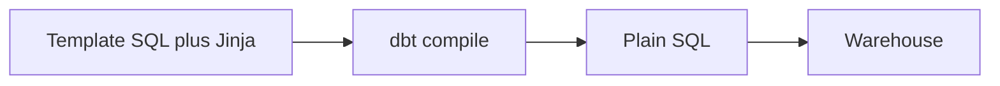
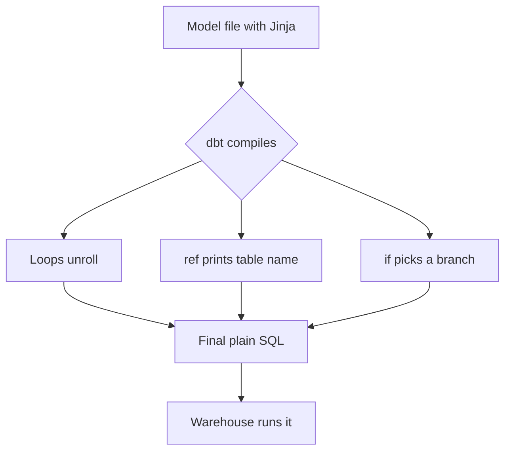

# Jinja Templating in dbt

*Part of [[dbt-data-build-tool-moc|dbt (Data Build Tool)]] · [[data-pipelines-moc|Data Pipelines]]*

← Prev: [[project-structure-staging-intermediate-marts|Project Structure: Staging, Intermediate & Marts]] · Next: [[macros-packages|Macros & Packages]] →

---

## Recap — where we just were

In [[project-structure-staging-intermediate-marts|Project Structure: Staging, Intermediate & Marts]] you sorted models into layers: staging cleans raw data, intermediate joins it, and marts serve the final tables. The project is well organised now.

But one thing kept showing up without explanation. You wrote `ref()` and `source()` inside your SQL files, and somehow dbt swapped them for real table names. That magic is **Jinja**. This lesson opens the box.

---

## Level 1 — The big idea

**Jinja** is a templating language. A templating language lets you write text with blanks and small bits of logic, then fills in the blanks to produce final text. It came from Python web tools, where people used it to build web pages.

dbt uses Jinja for SQL. You write a SQL file that is part real SQL and part template. Before dbt sends anything to the database, it runs your file through Jinja. The result is plain SQL with every blank filled in.

Think of **mail merge**. You write one letter that says "Dear ____," with a loop over a name list. The program prints one finished letter per name. Each reader only ever sees a finished letter, never the template.

Here the database is the reader. It only ever sees finished SQL.



The key idea: the warehouse never sees Jinja. Jinja is gone by the time SQL arrives.

---

## Level 2 — How it actually works

Jinja has two main tags. You write them inside curly braces.

- **Expressions** use double curly braces. They print a value into your SQL. `ref()` and `source()` are expressions — they print a table name.
- **Statements** use curly-brace-percent. They run logic: `for` loops, `if`/`else`, and `set` to make a variable. Statements do not print on their own.

Some useful built-in pieces:

- `ref()` and `source()` print table names. `config()` sets model options. These are all Jinja functions.
- `this` is the current model.
- `target.name` tells you the environment, like dev or prod.
- `var()` reads a project variable. `env_var()` reads a value from outside dbt.

Here is the crucial part: **Jinja runs at compile time**. Compile time is the moment, on your machine or in dbt, before any SQL is sent. Run time is later, when the warehouse runs the SQL. Loops and `if` blocks resolve at compile time. A loop **unrolls**: it turns into repeated SQL, written out fully.

dbt saves the result in the `target/compiled` folder. You can open that file and read the exact SQL the warehouse received. This is the single best habit for debugging Jinja: read the compiled file.



---

## Level 3 — See it with real numbers

A common job is turning rows into columns. Say each order has one **payment method**: cash, card, gift_card, or bank_transfer. You want one total column per method. That is four columns.

Writing four near-identical `sum(case when ...)` lines by hand is tedious and easy to mistype. A Jinja loop writes them for you.

Here is the template:

```sql


select
  order_id,
  
  sum(case when payment_method = '{{ method }}' then amount else 0 end) as {{ method }}_amount,
  
from {{ ref('stg_payments') }}
group by order_id
```

The list has 4 methods. The loop runs 4 times. So it unrolls into exactly 4 generated columns. The `loop.last` check stops a trailing comma after the final column. `ref()` becomes the real table name.

Here is the compiled SQL the warehouse actually receives:

```sql
select
  order_id,
  sum(case when payment_method = 'cash' then amount else 0 end) as cash_amount,
  sum(case when payment_method = 'card' then amount else 0 end) as card_amount,
  sum(case when payment_method = 'gift_card' then amount else 0 end) as gift_card_amount,
  sum(case when payment_method = 'bank_transfer' then amount else 0 end) as bank_transfer_amount
from analytics.dbt_staging.stg_payments
group by order_id
```

Count them: 4 methods in, 4 columns out. No Jinja remains. If you later add `apple_pay` to the list, the list has 5 items, the loop runs 5 times, and you get 5 columns — without touching the `select` body.

---

## Level 4 — In the real world & common traps

A real use case: **pivoting** rows into columns, exactly as above. Analytics teams pivot payment types, product categories, or survey answers this way. Another common use is **environment-aware logic**. In a dev environment you do not want to scan billions of rows, so you cap the data:

```sql
select * from {{ ref('stg_events') }}

where event_date >= dateadd('day', -3, current_date)

```

In dev, `target.name` is not prod, so the `where` clause appears and limits rows. In prod, the clause vanishes at compile time and the full table runs. The warehouse never knows a choice was made.

**People think: "Jinja runs inside the database."**
Actually: it does not. Jinja is compiled away on your side before any SQL reaches the warehouse. The database only ever sees finished SQL and has no idea Jinja existed.

**People think: "The loop runs every time the query runs."**
Actually: the loop runs once, at compile time. It unrolls into static SQL. At run time there is no loop left — just the repeated columns it produced.

**People think: "More Jinja always means better code."**
Actually: over-templating hurts. Deeply nested loops and conditions make SQL hard to read and debug. A reviewer often cannot tell what the final query looks like without compiling it. Favour clear SQL over clever templates, as in [[clean-code-refactoring|Clean Code & Refactoring]].

---

## Level 5 — Expert view

Three contrasts worth holding in your head:

| Pair | Left | Right |
| --- | --- | --- |
| Tag type | Expression in double braces prints a value | Statement in brace-percent runs logic, prints nothing |
| When it runs | Compile time, before SQL is sent | Run time, when warehouse executes SQL |
| What you write | Templated SQL with blanks and loops | Plain SQL the warehouse sees |

The core trade-off is **power and DRY versus readability**. DRY means "don't repeat yourself" — one loop instead of four copied lines. Jinja gives huge power: generate columns, switch behaviour by environment, share logic. But every layer of Jinja widens the gap between what you wrote and what runs. That gap is where bugs hide.

Practical rules experts follow: keep Jinja shallow, name list variables clearly, and always read the compiled file when something looks wrong. When logic gets reused across many models, move it out of inline Jinja and into a reusable **macro**, covered in [[macros-packages|Macros & Packages]]. A macro is a named, testable block of Jinja you call by name, which is cleaner than copying loops between files.

---

## Check yourself

**Memory hook:** *Jinja is mail merge for SQL — the warehouse only reads the finished letter.*

**Q1: When does a Jinja for-loop actually run?**
A: At compile time, on dbt's side, before any SQL is sent. It unrolls into static repeated SQL. At run time there is no loop.

**Q2: How do you see the exact SQL the warehouse received?**
A: Open the compiled version of the model in the `target/compiled` folder. It contains plain SQL with all Jinja resolved.

**Q3: A payment list has 4 methods and you loop over it to make sum columns. How many columns appear in the compiled SQL?**
A: Exactly 4 — one per item in the list. Add a fifth method and you get a fifth column automatically.

---

## Connects to

- [[macros-packages|Macros & Packages]] — package reusable Jinja into named macros.
- [[models-the-ref-function|Models & the ref() Function]] — `ref()` is itself a Jinja function.
- [[clean-code-refactoring|Clean Code & Refactoring]] — why readable beats clever when templating.

---

## Coming up next

You have seen inline Jinja. Next, [[macros-packages|Macros & Packages]] shows how to bottle that logic into reusable functions and pull in code other people already wrote.
