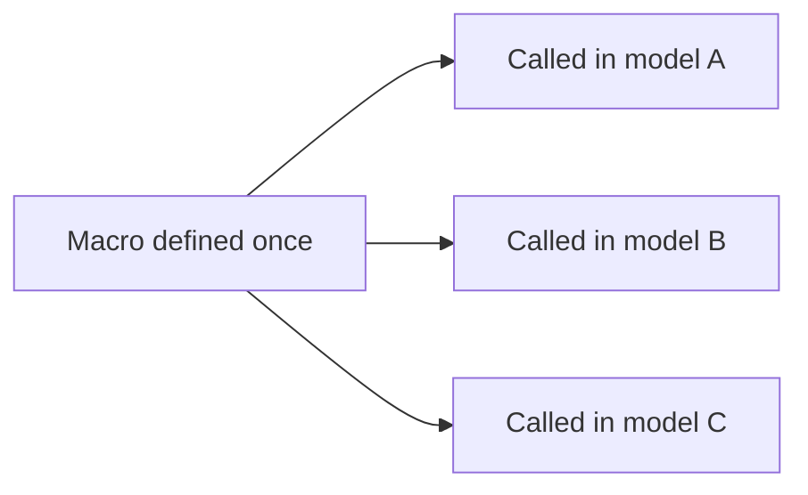
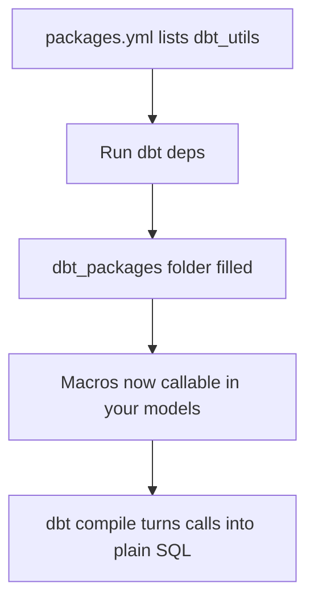

# Macros & Packages

*Part of [[dbt-data-build-tool-moc|dbt (Data Build Tool)]] · [[data-pipelines-moc|Data Pipelines]]*

← Prev: [[jinja-templating-in-dbt|Jinja Templating in dbt]] · Next: [[seeds|Seeds]] →

---

## Recap — where we just were

In the last lesson you met **Jinja**, the templating language dbt mixes into SQL. You saw `{{ ... }}` for values, `` for logic, and how dbt **compiles** that template into plain SQL before running it.

A **macro** is the natural next step. It is a named, reusable Jinja function. If Jinja is the grammar, a macro is a word you define once and then say everywhere.

---

## Level 1 — The big idea

Imagine you write the same scrap of SQL logic in twelve different models. Maybe every model divides a `amount_cents` column by 100 to get dollars. Copy-paste works until the rule changes. Then you must edit twelve files and hope you find them all.

A **macro** fixes this. You write the logic once, give it a name, and **call** it like a function wherever you need it. This is the **DRY principle** — Don't Repeat Yourself — applied to SQL (see [[clean-code-refactoring|Clean Code & Refactoring]]).

A **package** is the next level up. It is a reusable dbt project — a bundle of macros (and sometimes models and tests) that someone else built and shared. You install it once and use its tools in your own project.

Analogy: a macro is a kitchen gadget you build yourself and reuse for every dish. A package is a whole toolbox of gadgets someone else built, that you install once and keep.



One definition. Many calls. Change the definition, and every call updates.

---

## Level 2 — How it actually works

A macro lives in a `.sql` file inside the `macros/` folder of your dbt project. You define it with a `macro` block and end it with `endmacro`. Inside, you write Jinja that returns a string of SQL.

You call a macro with double curly braces, passing arguments like a function call. When dbt **compiles** your project, it replaces the call with the SQL string the macro produces. At query time the database sees only plain SQL — it never knows a macro existed.

A package works differently in setup but the same in spirit. You list packages in a file called `packages.yml`, each with a **version number**. Then you run the command `dbt deps` ("dependencies"). dbt downloads each package from **dbt Hub** (hub.getdbt.com), the official registry, and drops it into a `dbt_packages/` folder. Now every macro in that package is callable in your project.

The most-used package is **dbt_utils**. It ships battle-tested helpers like `generate_surrogate_key`, `star`, `date_spine`, and `pivot`. Others worth knowing: **dbt_expectations** (extra data tests), **codegen** (generates boilerplate model and YAML code), and **dbt_date** (date helpers).



Key point: a package adds macros and models that get compiled **into your project's own SQL**. It is not a library that runs separately at query time.

---

## Level 3 — See it with real numbers

Let's build a tiny macro. It converts a cents column into dollars by dividing by 100. We define it once in `macros/cents_to_dollars.sql`.

```sql

  ( {{ column_name }} / 100 )

```

Now we call it in a model `stg_orders.sql`:

```sql
select
  order_id,
  {{ cents_to_dollars('amount_cents') }} as amount_usd
from {{ source('shop', 'orders') }}
```

And again in a second model `stg_refunds.sql`:

```sql
select
  refund_id,
  {{ cents_to_dollars('refund_cents') }} as refund_usd
from {{ source('shop', 'refunds') }}
```

When dbt compiles `stg_orders.sql`, the call becomes plain SQL:

```sql
select
  order_id,
  ( amount_cents / 100 ) as amount_usd
from raw.shop.orders
```

Now the payoff. Suppose **12 models** each needed this divide-by-100 logic. Without a macro, the logic appears inline in **12 places**. If the finance team says "amounts are now stored in tenths of a cent, divide by 1000," you must edit all 12.

With the macro, the logic lives in **1 place**. You change one line — `/ 100` becomes `/ 1000` — and recompile. All **12** models pick up the new rule. Edits needed: 12 versus 1. Files at risk of a missed copy: 11 versus 0.

Here is how you would install dbt_utils. Create `packages.yml`:

```yaml
packages:
  - package: dbt-labs/dbt_utils
    version: 1.1.1
```

Then run `dbt deps`. dbt fetches version 1.1.1 and you can call its macros, for example:

```sql
select
  {{ dbt_utils.generate_surrogate_key(['order_id', 'line_id']) }} as order_line_key,
  order_id
from {{ ref('stg_orders') }}
```

Pinning the version (`1.1.1`, not "latest") means everyone on the team and every CI run installs the **exact same** code. That is reproducibility, the same discipline you use with [[version-control-with-git|Version Control with Git]].

---

## Level 4 — In the real world & common traps

**Named use case: surrogate keys in a star schema.** In a [[star-schema|Star Schema]] you give each dimension row a single **surrogate key** — a stable made-up ID. Building these by hand is fiddly and easy to do inconsistently. Teams use `dbt_utils.generate_surrogate_key` to hash one or more columns into a key the same way in every model. One helper, consistent keys across every fact and dimension table. The same idea covers standardising currency conversion: one shared macro means every model reports dollars the same way.

**People think: "Packages run like Python pip libraries at query time."**
Actually: no. A package adds macros and models that are **compiled into your project's SQL**. The database runs ordinary SQL. There is no package code executing alongside your query.

**People think: "A macro is magic."**
Actually: it is just a function that returns a SQL **string** at compile time. If you want to see exactly what it produced, read the compiled file in the `target/` folder. No magic, only text substitution.

**People think: "Always write your own helpers."**
Actually: reinventing a surrogate-key or pivot helper wastes time and adds bugs. Reuse battle-tested packages like **dbt_utils** first. Write your own macro only when nothing existing fits.

---

## Level 5 — Expert view

A macro, a model, and a package are easy to confuse. They sit at different layers.

| Thing | What it is | What it produces | Where it lives |
|---|---|---|---|
| Macro | A reusable Jinja function | A string of SQL at compile time | `macros/` folder |
| Model | A `select` statement dbt runs | A table or view in the warehouse | `models/` folder |
| Package | A shared dbt project of macros \| models \| tests | More macros and models you can call | `dbt_packages/` after `dbt deps` |

The core trade-off is **reuse and consistency versus an extra dependency to maintain**. A package gives you proven code for free. But every package is another version you must track, upgrade, and trust. When dbt_utils releases a new major version, your pinned version keeps you safe today, yet you eventually have to test the upgrade. That is the cost of the convenience.

The judgement call: pull in a package when it solves a hard, common problem (surrogate keys, date spines). Write a small local macro when the logic is specific to your business and short. Both serve [[clean-code-refactoring|Clean Code & Refactoring]]; both deserve a pinned version under [[version-control-with-git|Version Control with Git]] so results stay reproducible.

---

## Check yourself

**Memory hook:** *Macro = your gadget. Package = someone else's toolbox. Both compile down to plain SQL.*

**Q1: Where does a macro live, and what does it return?**
A: In a `.sql` file under the `macros/` folder. It returns a string of SQL at compile time, which dbt substitutes into the calling model.

**Q2: What does `dbt deps` do, and why pin a package version?**
A: It reads `packages.yml` and downloads each listed package from dbt Hub into `dbt_packages/`. Pinning a version means every install gets identical code, so results are reproducible across teammates and CI.

**Q3: A teammate says dbt_utils "runs at query time like a Python library." Correct them.**
A: It does not run separately. Its macros and models are compiled into your project's own SQL. The warehouse only ever runs plain SQL.

---

## Connects to

- [[jinja-templating-in-dbt|Jinja Templating in dbt]] — macros are named Jinja functions; this is the language they are written in.
- [[clean-code-refactoring|Clean Code & Refactoring]] — macros are the DRY principle applied to SQL.
- [[version-control-with-git|Version Control with Git]] — pinning package versions keeps installs reproducible, like locking dependencies.
- [[star-schema|Star Schema]] — `generate_surrogate_key` from dbt_utils builds consistent keys for facts and dimensions.

---

## Coming up next

Next we look at [[seeds|Seeds]] — small CSV files you check into your dbt project and load straight into the warehouse as tables, perfect for lookup lists and reference data.
