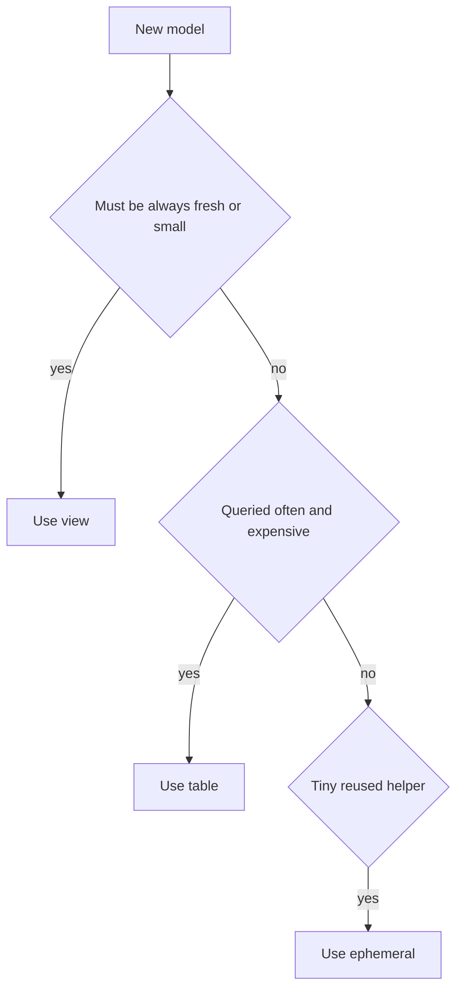
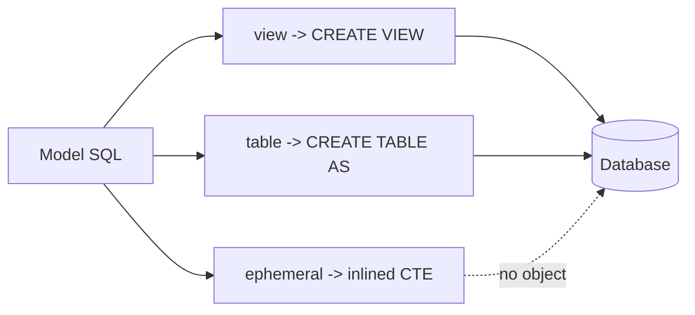

# Materializations

*Part of [[dbt-data-build-tool-moc|dbt (Data Build Tool)]] · [[data-pipelines-moc|Data Pipelines]]*

← Prev: [[sources-the-source-function|Sources & the source() Function]] · Next: [[incremental-models|Incremental Models]] →

---

## Recap — where we just were

In [[sources-the-source-function|Sources & the source() Function]] you learned to point dbt at raw tables and chain models together. A **model** is a SQL file that ends in a `SELECT`. You can now read raw data and build models on top of other models.

But one big question is still open. When dbt runs your `SELECT`, **where does the result go?** Does dbt save the rows? Save the query? Save nothing? That choice is called a **materialization**, and it is what this lesson is about.

---

## Level 1 — The big idea

A **materialization** is the strategy dbt uses to *persist* (store) a model's result in the database. You write one `SELECT`, and dbt decides what physical thing to build from it.

dbt has four built-in materializations: **view**, **table**, **ephemeral**, and **incremental**.

Think of a restaurant kitchen:

- A **view** is cooking a dish fresh every time someone orders. Always fresh, but slow because you cook on every order.
- A **table** is a pre-cooked tray kept warm. Made once, fast to serve, but it can go stale.
- An **ephemeral** model is an ingredient prepped only as part of another dish. It never gets plated on its own.

Here is a simple way to choose:



---

## Level 2 — How it actually works

You set the materialization with a **config block** at the top of a model:

```
{{ config(materialized='table') }}
```

Or you set a default for a whole folder in `dbt_project.yml`. If you set nothing, the default is **view**.

Here is what dbt physically does for each one.

- **view** (the default): dbt runs `CREATE VIEW`. A **view** is a saved query, not saved rows. Storage is cheap because no rows are stored. It always reflects the latest source data. But the query is **recomputed every time someone reads it** — slow for heavy or repeated reads.
- **table**: dbt runs `CREATE TABLE AS SELECT`. This stores the actual rows. Repeated reads are fast. But it uses storage, and it is **fully rebuilt on every `dbt run`**. The data is only as fresh as the last run.
- **ephemeral**: dbt builds **nothing** in the database. Instead it inlines the model's SQL as a **CTE** (common table expression — a named subquery written with `WITH`) inside any model that `ref()`s it. There is no database object, so you cannot query it directly.
- **incremental**: builds the table once, then on later runs adds only new rows instead of rebuilding everything. We cover this fully in [[incremental-models|Incremental Models]].



---

## Level 3 — See it with real numbers

Imagine a model called `daily_sales`. A dashboard reads it **1,000 times per day**. The underlying SQL is expensive — say it scans a big sales table.

**As a view:** the SQL is recomputed on every read. That is **1,000 recomputes per day**. No storage used, but a lot of compute.

**As a table:** dbt runs the SQL **once per daily `dbt run`** and stores the rows. The dashboard's 1,000 reads just scan stored rows, which is cheap. So you pay **1 expensive compute** plus 1,000 cheap reads — instead of 1,000 expensive computes.

The trade-off: the table uses storage, and its data is frozen until the next run.

Here is the model file:

```sql
-- models/marts/daily_sales.sql
{{ config(materialized='table') }}

select
    order_date,
    count(*)      as orders,
    sum(amount)   as revenue
from {{ ref('stg_orders') }}
group by order_date
```

When you run `dbt run`, dbt compiles that into plain SQL and sends it to the warehouse:

```sql
create table analytics.daily_sales as
select
    order_date,
    count(*)      as orders,
    sum(amount)   as revenue
from analytics.stg_orders
group by order_date
```

Notice `{{ ref('stg_orders') }}` became a real table name. With a view, dbt would send `create view ...` instead, and the heavy `group by` would re-run on each of the 1,000 reads.

---

## Level 4 — In the real world & common traps

A common, sensible pattern: make **staging models views** and **heavy marts tables**.

Staging models are thin and cleaning-only, so views keep them fresh and cost almost nothing to store. **Marts** (the final tables that dashboards read) are queried over and over, so building them as tables once per run saves huge repeated compute. You will see this layering in [[project-structure-staging-intermediate-marts|Project Structure: Staging, Intermediate & Marts]].

**People think: "Tables are always best because reads are fast."**
Actually: tables cost storage, are fully rebuilt on every run, and go stale between runs. For a small model that must always show live data, a view is the better choice.

**People think: "Views are free."**
Actually: a view stores no rows, but every query re-runs the underlying SQL. If 1,000 reads each trigger a heavy scan, the compute bill is real and repeated.

**People think: "I can query an ephemeral model in the warehouse."**
Actually: there is no database object for it. dbt only inlines its SQL as a CTE inside models that `ref()` it. If you open the warehouse and look, you will not find it.

---

## Level 5 — Expert view

The four materializations trade four things: storage used, build cost per run, read speed, and data freshness.

| Materialization | Storage used | Build cost per run | Read speed | Data freshness |
| --- | --- | --- | --- | --- |
| view | none | tiny \| just defines query | slow \| SQL re-runs each read | always live |
| table | full copy | high \| full rebuild | fast \| reads stored rows | as of last run |
| ephemeral | none | none \| no object built | n\/a \| inlined into parent | always live |
| incremental | full copy | low \| only new rows added | fast \| reads stored rows | as of last run |

The deep trade-off is **storage plus staleness versus compute on read**. A view pushes all cost to read time and stays live. A table pays once at build time and then reads cheaply, but freezes the data.

Two connections sharpen this. Because a table stores real rows, you can speed reads further with [[indexing|Indexing]] (and clustering) — a view cannot be indexed on its own. And the cost of "recompute on every read" is exactly a [[big-o-time-complexity|Big-O / Time Complexity]] question: a view turns one expensive query into N expensive queries, where N is how often it is read.

When N is large and the SQL is heavy, a table or incremental model almost always wins. When N is small or freshness must be live, a view wins.

---

## Check yourself

**Memory hook:** *View saves the query, table saves the rows, ephemeral saves nothing.*

**Q1: What is the default materialization if you set nothing?**
A: view. dbt runs `CREATE VIEW`, so no rows are stored and the SQL re-runs on each read.

**Q2: Why can a table model show stale data?**
A: A table is fully rebuilt only on `dbt run`. Between runs the stored rows do not change, so they reflect the last run, not live source data.

**Q3: Can you `SELECT` from an ephemeral model in your warehouse?**
A: No. There is no database object. dbt inlines its SQL as a CTE inside models that `ref()` it, so it only exists within those compiled queries.

---

## Connects to

- [[incremental-models|Incremental Models]] — the build-once-then-add-new-rows strategy, our next step beyond plain tables.
- [[models-the-ref-function|Models & the ref() Function]] — `ref()` is how dbt knows which table, view, or CTE a model points to.
- [[indexing|Indexing]] — tables can be indexed or clustered for faster reads; views cannot on their own.

---

## Coming up next

A table rebuilds fully every run, which is wasteful when only a few new rows arrive each day. Next, [[incremental-models|Incremental Models]] shows how dbt builds a model once and then appends only the new rows — keeping read speed high while cutting build cost.
