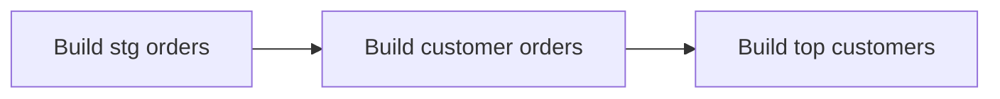
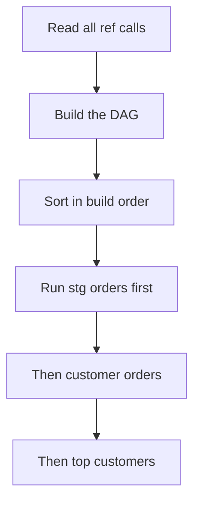

# Models & the ref() Function

*Part of [[dbt-data-build-tool-moc|dbt (Data Build Tool)]] · [[data-pipelines-moc|Data Pipelines]]*

← Prev: [[dbt-projects-profiles-targets|dbt Projects, Profiles & Targets]] · Next: [[sources-the-source-function|Sources & the source() Function]] →

---

## Recap — where we just were

In [[dbt-projects-profiles-targets|dbt Projects, Profiles & Targets]] you set up the project. dbt now knows which warehouse to connect to and which schema to write into. The plumbing is done. But a configured project that contains no logic does nothing useful.

Now you write the actual building blocks. In dbt those are called **models**. This lesson explains what a model is and how the `ref()` function lets models build on top of each other safely.

---

## Level 1 — The big idea

A **model** is one `.sql` file inside the `models/` folder. It contains exactly **one** `SELECT` statement. That is the whole rule. The file's name *is* the model's name, and it is also the name of the table or view that dbt creates in the warehouse. A file called `customer_orders.sql` becomes a table called `customer_orders`.

You never write `CREATE TABLE`. You only write the `SELECT`. dbt wraps it for you. (How it wraps it — table, view, and others — is set by the **materialization**, covered soon in [[materializations|Materializations]].)

Real pipelines have many models, and later ones reuse earlier ones. To point one model at another, you use the **`ref()` function**.

Think of a cookbook. Recipe #2 makes a sauce. Recipe #5 (the dish) does not re-list every sauce ingredient. It says "use the sauce from recipe #2." The cook then knows to make the sauce **first**, then the dish. `ref()` is that "use recipe #2" instruction. dbt is the cook who works out the order.



Each arrow means "is built from." dbt builds left to right.

---

## Level 2 — How it actually works

Inside a model you reference another model like this: `{{ ref('stg_orders') }}`. The double curly braces mean dbt processes this before sending SQL to the warehouse. `ref()` does **two** jobs at once.

**Job 1 — it returns the correct table name.** The warehouse does not understand `ref()`. So dbt replaces `{{ ref('stg_orders') }}` with the real, fully-qualified name, such as `analytics.stg_orders`. This step is called **compiling**. The clever part: in your development schema it compiles to `dev_amber.stg_orders`, and in production it compiles to `analytics.stg_orders` — same code, different real name. You get this portability for free. If you hard-coded `analytics.stg_orders` yourself, your dev runs would read production tables, which is dangerous.

**Job 2 — it registers a dependency.** When dbt sees `ref('stg_orders')` inside `customer_orders`, it records: "`customer_orders` depends on `stg_orders`." dbt scans every model for these `ref()` calls and assembles a **dependency graph**. This is a **DAG** — a directed acyclic graph (see [[dags-schedulers|DAGs & Schedulers]]). "Directed" means arrows have a direction. "Acyclic" means no loops.

dbt then runs the models in **topological order**: every model is built only after all the models it depends on are already built. Dependencies first, dependents last.



The rule "you should NEVER hard-code another model's table name — always `ref()` it" exists because hard-coding breaks **both** jobs: it loses dev/prod portability, and it hides the dependency so dbt may build things in the wrong order.

---

## Level 3 — See it with real numbers

Three models. Start with a raw orders table holding **1,000** order rows.

**Model 1: `stg_orders.sql`** — clean the raw data. One row per order, so **1,000 rows**.

```sql
-- models/staging/stg_orders.sql
SELECT
    order_id,
    customer_id,
    order_total
FROM raw.orders
```

**Model 2: `customer_orders.sql`** — count orders per customer. Suppose the 1,000 orders come from **200** distinct customers, so this returns **200 rows**.

```sql
-- models/marts/customer_orders.sql
SELECT
    customer_id,
    count(*) AS order_count
FROM {{ ref('stg_orders') }}
GROUP BY customer_id
```

**Model 3: `top_customers.sql`** — the 10 busiest customers, so **10 rows**.

```sql
-- models/marts/top_customers.sql
SELECT
    customer_id,
    order_count
FROM {{ ref('customer_orders') }}
ORDER BY order_count DESC
LIMIT 10
```

Now trace the build. dbt reads the `ref()` calls: `customer_orders` refs `stg_orders`; `top_customers` refs `customer_orders`. That gives one chain:

```
stg_orders  ->  customer_orders  ->  top_customers
1,000 rows      200 rows             10 rows
```

The arithmetic stays consistent: 1,000 raw orders collapse into 200 customers, then the top 10 are sliced off. dbt builds `stg_orders` first (nothing else exists yet), then `customer_orders` (its dependency is ready), then `top_customers` (its dependency is ready). If you ran `top_customers` first, it would fail — `customer_orders` would not exist yet. `ref()` is what stops that from happening.

---

## Level 4 — In the real world & common traps

**Named use case: refactoring a giant query.** A common starting point is one 500-line SQL query that does everything — joins, cleaning, aggregation, ranking — in a single statement. It is hard to read, hard to test, and if one part breaks you re-run all 500 lines. Teams split it into small models that `ref()` each other: a staging model to clean, an intermediate model to join, a marts model to aggregate. This is exactly the modular thinking from [[clean-code-refactoring|Clean Code & Refactoring]]. Each piece is small, named, and reusable.

**People think: "ref() is just a fancy way to write a table name."**
Actually: it does that, but it also records the dependency and sets the build order. A plain table name gives you neither. That second job is the whole reason dbt knows what to build first.

**People think: "I can just hard-code the production table name."**
Actually: that breaks dev/prod portability — your development run would read or overwrite production data — and it hides the dependency, so dbt may build models in the wrong order. Always use `ref()`.

**People think: "Two models can ref each other, A refs B and B refs A."**
Actually: no. The graph must be **acyclic** (see [[dags-schedulers|DAGs & Schedulers]]). A loop means there is no valid order — neither can be built first — so dbt refuses and raises a cycle error.

---

## Level 5 — Expert view

There are three ways to point a query at data. Only two are correct, and they do different things. (`source()` is the next lesson.)

| Way | Portable dev/prod | Tracked in DAG | Points to |
|---|---|---|---|
| `{{ ref('x') }}` | Yes | Yes | another dbt **model** |
| `{{ source('s','t') }}` | Yes | Yes | a **raw input table** dbt did not build |
| `analytics.x` hard-coded | No | No | a fixed table name, no smarts |

The trade-off: `ref()` and `source()` cost a little discipline — you must wrap every reference in a function instead of typing a name. In return dbt can build the correct DAG, run things in order, and swap schemas between environments automatically. Hard-coding feels faster for one query but scales terribly: it silently couples your code to one environment and to one build order you must remember by hand.

A practical rule: anything **dbt builds** gets `ref()`; anything **dbt did not build** (raw landing data) gets `source()`. Together these `ref()` chains are how you construct the dimension and fact tables of a [[star-schema|Star Schema]] — each model is one node, and the marts at the end are the tables your analysts query.

---

## Check yourself

**Memory hook:** *`ref()` is "use recipe #2" — it names the dish AND tells the cook to make it first.*

**Q1: What two things does `ref()` do?**
A: It returns the correct fully-qualified table name (so code works in dev and prod), and it registers a dependency so dbt builds that model first.

**Q2: Why should you never hard-code another model's table name?**
A: It loses dev/prod portability and hides the dependency, so dbt may build models in the wrong order.

**Q3: Why can't model A `ref()` B while B `ref()`s A?**
A: That creates a cycle. The DAG must be acyclic, so there is no valid build order and dbt raises an error.

---

## Connects to

[[sources-the-source-function|Sources & the source() Function]] · [[dags-schedulers|DAGs & Schedulers]] · [[materializations|Materializations]] · [[clean-code-refactoring|Clean Code & Refactoring]]

---

## Coming up next

→ [[sources-the-source-function|Sources & the source() Function]] — `ref()` points at models dbt builds, but every pipeline starts from raw tables dbt did **not** build. Next you learn `source()`, the matching function for those inputs.
