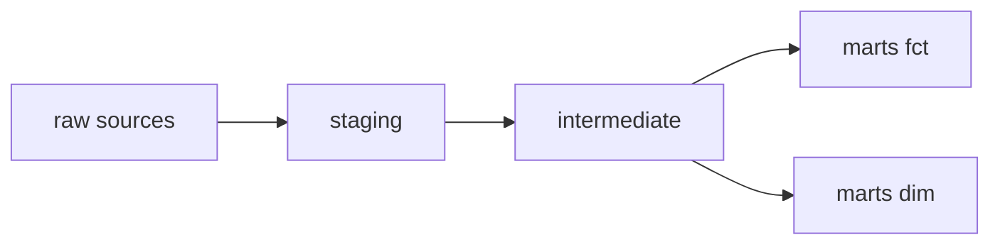
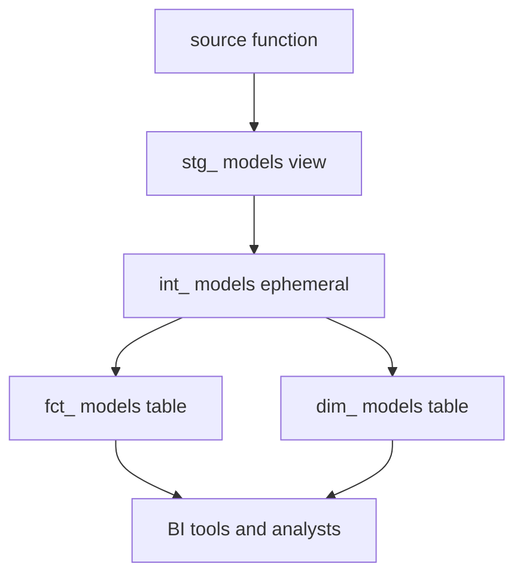

# Project Structure: Staging, Intermediate & Marts

*Part of [[dbt-data-build-tool-moc|dbt (Data Build Tool)]] · [[data-pipelines-moc|Data Pipelines]]*

← Prev: [[incremental-models|Incremental Models]] · Next: [[jinja-templating-in-dbt|Jinja Templating in dbt]] →

---

## Recap — where we just were

In [[incremental-models|Incremental Models]] you learned to build a single model efficiently — only processing new rows instead of rebuilding everything. That is about making *one* model fast.

But a real dbt project does not have one model. It has dozens, sometimes hundreds. If you just dump them all in a pile, nobody can find anything or trust what they read. This lesson is about *organising* those models so the whole project stays understandable.

---

## Level 1 — The big idea

dbt has a conventional way to arrange models in three layers. Each layer has a job. Think of it as a kitchen line in a restaurant.

- **Staging** — washing and chopping each ingredient. One prep per ingredient.
- **Intermediate** — making sauces and components that several dishes share.
- **Marts** — the finished, plated dishes served to customers.

Data flows the same way: raw sources come in, get cleaned in staging, get combined in intermediate, and end up as polished marts that analysts query.

A **mart** is a final, business-facing table. A **layer** is just a folder of models that do a similar kind of work.



Each layer only reads from the layer to its left. You never skip backward. That single rule is what keeps a big project from turning into spaghetti.

---

## Level 2 — How it actually works

Each layer has clear conventions: a name prefix, a typical materialization, and a rule about what it may read.

**Staging** (prefix `stg_`). One model per raw source table — a strict 1:1 mapping. It does light cleaning only: rename columns to friendly names, cast types, standardise simple values. No joins, no business logic. Staging models select from `source()` — see [[sources-the-source-function|Sources & the source() Function]]. They are usually built as **views**, because they are thin and cheap.

**Intermediate** (prefix `int_`). Reusable building blocks. An intermediate model combines staging models and holds business logic that more than one mart needs. If two marts both need "orders joined to their line items", you compute that once here instead of twice. These are often **ephemeral** (inlined at compile time) or views.

**Marts** (prefix `fct_` for facts, `dim_` for dimensions). A **fact** table records events or measurements — one row per order, payment, or click — keyed to the entities involved; a **dimension** table describes those entities — one row per customer, product, or date — with their attributes. The final tables analysts and BI tools query. They are usually built as **tables** for fast reads, and shaped as a [[star-schema|Star Schema]]. Marts deliberately *denormalize* — they fold related data together so a query needs fewer joins. That is the opposite of an app database; see [[normalization-vs-denormalization|Normalization vs Denormalization]].

A **materialization** is how dbt stores a model — as a view, a table, ephemeral, and so on (full detail in [[materializations|Materializations]]).



You do not set the materialization on every file by hand. You set a default per folder in `dbt_project.yml`. Everything in `staging/` becomes a view; everything in `marts/` becomes a table. Individual models can override the default when needed.

---

## Level 3 — See it with real numbers

Here is a small but complete project. It has **2 staging + 1 intermediate + 2 marts = 5 models**.

```bash
models/
├── staging/
│   └── jaffle_shop/
│       ├── stg_orders.sql        # 1:1 with raw orders, view
│       └── stg_customers.sql     # 1:1 with raw customers, view
├── intermediate/
│   └── int_orders_joined.sql     # joins orders + customers, ephemeral
└── marts/
    └── core/
        ├── fct_orders.sql        # fact table, one row per order
        └── dim_customers.sql     # dimension table, one row per customer
```

Notice the shape. Two raw tables produce two staging models — that is the 1:1 rule. The intermediate model joins them once. The two marts then build on that shared work.

Now the folder-level config that controls materialization:

```yaml
# dbt_project.yml
models:
  jaffle_shop:
    staging:
      +materialized: view
    intermediate:
      +materialized: ephemeral
    marts:
      +materialized: table
```

With this, running `dbt build` creates 2 views (staging), inlines 1 ephemeral model (intermediate, so it produces no separate object), and writes 2 tables (marts). So in the warehouse you end up with 2 views + 2 tables = **4 stored objects** from 5 models, because the ephemeral one is never stored on its own.

Scale that up: 60 sources give you 60 staging models, maybe 20 intermediate models, and 30 marts — 110 models — and every single one is named so you know its layer at a glance.

---

## Level 4 — In the real world & common traps

**Use case: a 300-model analytics project.** A mid-size company's data team has roughly 300 models. It stays navigable for one reason: consistent layering and naming. A new hire sees `stg_payments` and instantly knows it is a thin 1:1 staging view. They see `fct_orders` and know it is a final fact table. Without the convention, finding the right model in 300 files would be a daily nightmare.

**People think: "This structure is bureaucracy you can skip on small projects."**
Actually: the layering is exactly what keeps large projects maintainable and testable. Each layer is a clean place to add tests and find bugs. Skipping it is fine for 5 models and painful at 100. The habit is what scales — this is applied [[clean-code-refactoring|Clean Code & Refactoring]].

**People think: "Just write one big model that does everything in one file."**
Actually: a giant model is unreadable, hard to test, and impossible to reuse. If three reports need the same joined orders, the single-model approach makes you copy that logic three times. Layering computes it once in an intermediate model.

**People think: "Marts should be fully normalized, like an app's database."**
Actually: no. App databases normalize to avoid duplicated data on writes. Marts *denormalize* so analytics queries are fast and need fewer joins — see [[normalization-vs-denormalization|Normalization vs Denormalization]] and the [[star-schema|Star Schema]] they are usually shaped into.

---

## Level 5 — Expert view

The three layers differ across every dimension that matters:

| Aspect | Staging | Intermediate | Marts |
|---|---|---|---|
| Prefix | `stg_` | `int_` | `fct_` \| `dim_` |
| Purpose | clean one source | reusable logic | business-facing output |
| Typical materialization | view | ephemeral \| view | table |
| Who reads it | other dbt models | other dbt models | analysts and BI tools |
| 1:1 with a source? | yes | no | no |

**The core trade-off.** More layers means more files. A project that *could* be 5 models becomes 11 once you split staging, intermediate, and marts. That is real overhead — more files to open, more `ref()` calls to wire up.

What you buy with that overhead: reuse (shared logic lives in one place), clarity (the prefix tells you a model's job instantly), and testability (each layer is a clean checkpoint for [[data-quality-validation|Data Quality & Validation]]). For tiny throwaway projects the overhead can outweigh the gain. For anything that grows or has more than one author, the structure pays for itself quickly.

A subtler expert point: intermediate is the layer people get wrong. Too few intermediate models and marts duplicate logic. Too many and you get a maze of half-finished pieces. The rule of thumb — create an intermediate model only when logic is genuinely shared by more than one downstream model, or when one mart is so complex it needs to be broken into readable steps.

---

## Check yourself

**Memory hook:** *Stage it, share it, serve it — staging cleans, intermediate combines, marts serve.*

**Q1: What is the 1:1 rule for staging models?**
A: There is exactly one staging model per raw source table. Each `stg_` model maps to a single source and does light cleaning only — renames, casts, simple standardisation — with no joins.

**Q2: Why are marts usually materialized as tables while staging is usually views?**
A: Marts are queried directly by analysts and BI tools, so they need fast reads, which tables give. Staging models are thin pass-throughs read by other models, so cheap-to-build views are fine.

**Q3: When should you add an intermediate model instead of putting logic straight in a mart?**
A: When the same business logic is needed by more than one mart, or when a mart is complex enough that splitting it into named steps makes it readable. Otherwise the extra file is just overhead.

---

## Connects to

- [[star-schema|Star Schema]] — the shape marts are usually built into.
- [[normalization-vs-denormalization|Normalization vs Denormalization]] — why marts denormalize instead of normalize.
- [[materializations|Materializations]] — how each layer's view/ephemeral/table choice actually works.
- [[clean-code-refactoring|Clean Code & Refactoring]] — layering is this idea applied to data models.

---

## Coming up next

Layering tells you *where* a model goes. Next you will see how to make the SQL inside those models dynamic and reusable with [[jinja-templating-in-dbt|Jinja Templating in dbt]] — the templating language that lets one model adapt to many situations.
