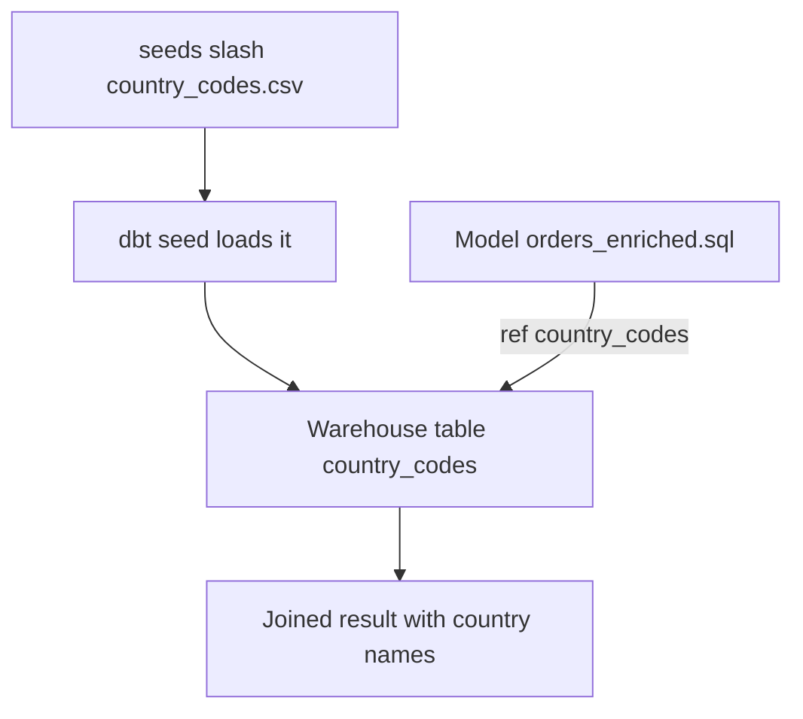

# Seeds

*Part of [[dbt-data-build-tool-moc|dbt (Data Build Tool)]] · [[data-pipelines-moc|Data Pipelines]]*

← Prev: [[macros-packages|Macros & Packages]] · Next: [[snapshots-scd-type-2|Snapshots & SCD Type 2]] →

---

## Recap — where we just were

In [[macros-packages|Macros & Packages]] you learned to reuse logic. A macro is a reusable chunk of SQL-generating code, and a package is a bundle of macros and models you install from someone else.

Macros reuse *logic*. But sometimes you do not need reusable logic. You need a small slab of static *data* that lives nowhere else yet. A list of country codes. A table that says status code `1` means "pending". That data has to come from somewhere. Seeds are how dbt lets you bring it in.

---

## Level 1 — The big idea

A **seed** is a CSV file you put in the `seeds/` folder of your dbt project. A CSV (comma-separated values) is just a plain text table: one row per line, columns split by commas.

When you run the command `dbt seed`, dbt reads that CSV and loads it into your data warehouse as a real table. After that, you reference it from your models exactly like any other table, using `ref('seed_name')`.

Here is the whole flow.


The key idea: the data starts as a file *inside your project*, checked into [[version-control-with-git|Version Control with Git]] right next to your code. You wrote it. You own it. Git remembers every change to it.

Think of a seed as a small printed reference card you keep in your binder. You filled it in by hand, it travels with the binder, and you can flip back to old versions. That is different from the daily newspaper that gets delivered from outside each morning. Those outside deliveries are raw **sources**, which we will contrast later.

---

## Level 2 — How it actually works

A seed has three moving parts.

**1. The CSV file.** It sits in `seeds/`, for example `seeds/country_codes.csv`. The first line is the header row naming the columns. Every line after it is one row of data.

**2. The `dbt seed` command.** Running it tells dbt to create (or replace) a table named after the file. So `country_codes.csv` becomes a table called `country_codes` in your warehouse. By default dbt guesses each column's data type from the values, but you can override this in a YAML config file and declare types yourself, which is safer.

**3. The `ref()` call.** Once seeded, the table behaves like any model. A model that writes `from {{ ref('country_codes') }}` will join against it. dbt also tracks it in the dependency graph, so it knows the seed must be loaded before any model that uses it runs.



To change seed data, you edit the CSV and run `dbt seed` again. You do not log into the warehouse and edit the table by hand. The CSV in git is the single source of truth, so the file and the table stay in sync, and the change is reviewable.

---

## Level 3 — See it with real numbers

Say your `orders` table stores a two-letter `country_code` but not the full name. Dashboards want the readable name. You build a small lookup seed.

Here is the CSV file, `seeds/country_codes.csv`, with three rows:

```bash
cat seeds/country_codes.csv
```

```
country_code,country_name
US,United States
GB,United Kingdom
IN,India
```

Three data rows, two columns. Tiny. Now load it:

```bash
dbt seed --select country_codes
```

dbt creates a warehouse table `country_codes` holding those exact three rows. Now write a model, `models/marts/orders_enriched.sql`, that joins orders to the seed:

```sql
select
    o.order_id,
    o.country_code,
    c.country_name
from {{ ref('orders') }} as o
left join {{ ref('country_codes') }} as c
    on o.country_code = c.country_code
```

Walk through the numbers. Suppose `orders` has 5 rows with these codes: `US, IN, US, GB, US`. The join matches each code to its name:

- 3 rows with `US` → "United States"
- 1 row with `IN` → "India"
- 1 row with `GB` → "United Kingdom"

That is 3 + 1 + 1 = 5 output rows, every one now carrying a `country_name`. The seed has only 3 rows, but it serves all 5 order rows because the same lookup value is reused. A `left join` means even an unknown code would still produce a row, just with a blank country name. That is why small lookups are powerful: a 3-row file decorates an order table of any size.

---

## Level 4 — In the real world & common traps

**Named use case: status code labels and finance thresholds.** Internal systems often store statuses as bare numbers to save space: `1`, `2`, `3`. A seed maps them to human labels.

```
status_code,status_label
1,Pending
2,Shipped
3,Delivered
```

Dashboards join on this seed so people see "Shipped" instead of `2`. A second classic case: a finance team keeps a small table of approval thresholds. Analysts edit the CSV and open a pull request, so every change passes through [[code-review-pull-requests|Code Review & Pull Requests]] before it touches the data. The threshold logic becomes auditable instead of buried in a spreadsheet.

**People think: "Seeds are for loading big datasets into the warehouse."**
Actually: seeds are for *small, static* reference data only. There are no transformations, large CSVs load slowly, and a big file bloats your git repository forever. Anything large should be loaded by a separate EL tool and declared as a source instead. See [[sources-the-source-function|Sources & the source() Function]].

**People think: "Seeds and sources are the same thing."**
Actually: a seed is a CSV *you* authored and maintain inside the project. A source is a raw table loaded into the warehouse by some external pipeline that you only point at, not create. Different origins, different owners.

**People think: "To fix wrong seed data, I edit the warehouse table directly."**
Actually: you edit the CSV in git and re-run `dbt seed`. Editing the warehouse table by hand desyncs it from the file, and the next `dbt seed` would overwrite your manual fix anyway.

---

## Level 5 — Expert view

The sharp question is always: seed, source, or model? Each is a different kind of input.

| Aspect | Seed | Source | Model |
|---|---|---|---|
| Origin | CSV you author | Raw table loaded by an external tool | SQL you write |
| Who maintains it | You, in the project | The team running the EL pipeline | You, in the project |
| Typical size | Small (tens to hundreds of rows) | Any size, often huge | Any size |
| Lives in git? | Yes, the data itself | No, only a reference to it | Yes, the SQL only |
| Referenced with | `ref()` | `source()` | `ref()` |

The trade-off is sharp. Seeds give you two real gifts: convenience (no pipeline needed to get a lookup in) and full versioning (git tracks every edit, reviewable in a pull request). The cost is that they are unsuitable for anything large or frequently changing. Each `dbt seed` reloads the whole file, large files are slow, and large or churning CSVs bloat the repository's history permanently.

A good rule: if a human can reasonably maintain the data by hand and it rarely changes, seed it. If a machine produces it or it grows, make it a source. Compare against [[sources-the-source-function|Sources & the source() Function]], and remember the versioning win comes straight from [[version-control-with-git|Version Control with Git]].

---

## Check yourself

**Memory hook:** *A seed is a reference card in your binder; a source is the newspaper delivered from outside.*

**Q1: Where does a seed file live, and what command loads it?**
A: It lives as a CSV in the `seeds/` folder of your dbt project. Running `dbt seed` loads it into the warehouse as a table.

**Q2: You find a typo in a seed's data. What do you do?**
A: Edit the CSV file in git and re-run `dbt seed`. You never edit the warehouse table directly, because the next seed run would overwrite it and the file is the source of truth.

**Q3: Your team needs to bring in a 50-million-row clickstream table. Seed or source?**
A: A source. It is large and machine-produced, so an EL tool should load it and you declare it as a source. Seeds are only for small, static, hand-maintained data.

---

## Connects to

- [[sources-the-source-function|Sources & the source() Function]] — the right home for large, externally loaded data; the natural contrast to seeds.
- [[version-control-with-git|Version Control with Git]] — why a seed's data and its full history are reviewable.
- [[models-the-ref-function|Models & the ref() Function]] — how you reference a seed once it is loaded.

---

## Coming up next

Seeds handle small data you control. But what about tracking how a record *changes over time* when the source only ever shows you its current state? Next we meet [[snapshots-scd-type-2|Snapshots & SCD Type 2]], dbt's way of recording history.
