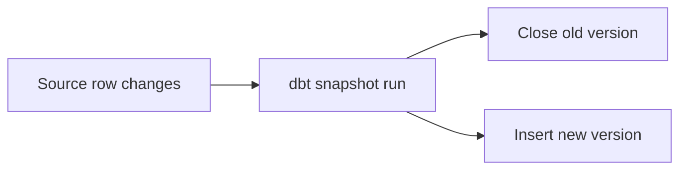
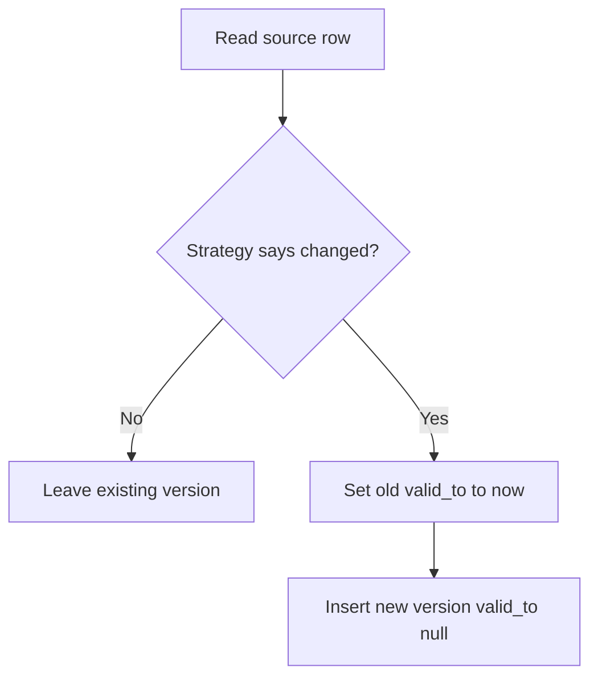

# Snapshots & SCD Type 2

*Part of [[dbt-data-build-tool-moc|dbt (Data Build Tool)]] · [[data-pipelines-moc|Data Pipelines]]*

← Prev: [[seeds|Seeds]] · Next: [[tests|Tests]] →

## Recap — where we just were

In [[seeds|Seeds]] you learned to load small, static data — a CSV that you control and that barely changes. A seed is something *you* edit and version.

But not all source data sits still. Some source tables are **mutable**: a row gets updated in place, and the old value vanishes. A customer's plan changes from free to paid, and the database simply overwrites "free" with "paid". The history is gone.

Snapshots fix that. A **snapshot** records each version of a row over time, so you keep the whole story instead of just the latest state.

---

## Level 1 — The big idea

Imagine a page in a notebook. Someone keeps erasing it and writing a new value. If you only ever read the page *now*, you never know what it said yesterday.

A snapshot is like taking a **dated photo** of the page every time it changes. You keep every version, each stamped with the dates it was true. No eraser. Nothing lost.

This is the database pattern called **Slowly Changing Dimension (SCD) Type 2**: a *dimension* (a descriptive table, like customers) that changes slowly, where each change creates a **new row** instead of overwriting the old one. We met this idea in [[slowly-changing-dimensions|Slowly Changing Dimensions]].

When a tracked row changes, dbt does two things: it **closes** the old version (marks when it stopped being true) and **inserts** a new version (marks when the new value started).



---

## Level 2 — How it actually works

You define a snapshot in the `snapshots/` folder of your dbt project. You pick a **strategy** (how dbt decides a row changed) and a **unique_key** (which column identifies one real thing, like a customer). Then you run `dbt snapshot`.

dbt builds a table that holds every version of every row, plus four **meta columns** it manages for you:

- `dbt_valid_from` — when this version started being true.
- `dbt_valid_to` — when this version stopped being true. **NULL means it is the current, active version.**
- `dbt_scd_id` — a unique id for each version row.
- `dbt_updated_at` — the timestamp dbt used for this version.

Each time you run `dbt snapshot`, dbt compares the source to what it already stored. If a tracked row changed, dbt closes the old version (sets its `dbt_valid_to` to *now*) and inserts a new version (`dbt_valid_from` = now, `dbt_valid_to` = null).

There are two strategies:

- **timestamp** — the source has an `updated_at` column. dbt treats a newer timestamp as "this row changed". This is the preferred strategy when a reliable `updated_at` exists.
- **check** — you list a set of columns. dbt compares them; if any value differs, it counts as a change. Use this when there is no trustworthy timestamp.



A blunt but important limit: a snapshot can only capture changes that happen **after** you start snapshotting, and only changes you actually run often enough to catch. If the source overwrites a value twice between two snapshot runs, the middle state is lost forever. You cannot recover history you never photographed.

---

## Level 3 — See it with real numbers

We have a `customers` source. Customer 1 starts on the **free** plan. On 2026-03-01 they upgrade to **paid**, and the source row is updated in place.

Here is the snapshot definition. It uses the **timestamp** strategy on the source's `updated_at` column, and `customer_id` as the unique key.

```sql


{{
  config(
    target_schema='snapshots',
    unique_key='customer_id',
    strategy='timestamp',
    updated_at='updated_at'
  )
}}

select customer_id, plan, updated_at
from {{ source('app', 'customers') }}


```

**Run 1** happens on 2026-01-01. Customer 1 is on the free plan. dbt inserts one version, open (valid_to is null).

**Run 2** happens on 2026-03-01, just after the upgrade. dbt sees `updated_at` moved forward, so it closes the old version and inserts a new one.

After both runs, the snapshot table holds two rows for customer 1:

| customer_id | plan | dbt_valid_from | dbt_valid_to |
|---|---|---|---|
| 1 | free | 2026-01-01 | 2026-03-01 |
| 1 | paid | 2026-03-01 | null |

Read it carefully. The old row's `dbt_valid_to` (2026-03-01) equals the new row's `dbt_valid_from` (2026-03-01). That shared boundary is how SCD Type 2 stays gap-free: the free version was true for exactly 59 days (Jan 1 to Mar 1), then the paid version took over. The row with `dbt_valid_to = null` is the one that is true *right now*.

To ask "what plan was customer 1 on during February?", you filter where `dbt_valid_from <= '2026-02-15'` and (`dbt_valid_to > '2026-02-15'` or `dbt_valid_to is null`). That returns the free row. Time travel, by query.

---

## Level 4 — In the real world & common traps

**Named use case: subscription tier history for finance.** Finance needs to attribute revenue to the correct plan at each point in time. If a customer was free in January and paid from March, the March invoice should map to "paid" and any January analysis to "free". A snapshot of the subscription tier gives finance exactly that timeline. These historical versions then feed a dimension table in your [[star-schema|Star Schema]].

**People think: "Snapshots track every column change automatically."**
Actually: no. The **strategy** decides what counts as a change. With the `check` strategy, only the columns you list are compared — a change to any other column is ignored. With `timestamp`, dbt trusts the `updated_at` column, not the individual fields. You choose what "changed" means.

**People think: "You can reconstruct history you didn't snapshot."**
Actually: no. Snapshots only see what was in the source *when a run happened*. If a value was overwritten before your first run, or flipped twice between two runs, those states are gone. You must snapshot before and around the changes you care about. Lost overwrites stay lost.

**People think: "Snapshots are just incremental models."**
Actually: different purpose. [[incremental-models|Incremental Models]] exist to add new rows **efficiently** — to avoid rebuilding a huge table every run. Snapshots exist to **preserve the history** of mutable rows. One is about speed; the other is about memory of the past. They are not interchangeable.

---

## Level 5 — Expert view

Four patterns get confused. Here is the clean contrast.

| Pattern | What it tracks \| handles | History kept? |
|---|---|---|
| **Snapshot** | Versions of mutable source rows over time | Yes — every version, dated |
| **Incremental model** | New or updated rows appended efficiently | No — it is about speed, not history |
| **SCD Type 1** | Overwrite the dimension with the latest value | No — old value is lost |
| **SCD Type 2** | New row per change, with valid_from \| valid_to | Yes — full timeline |

A dbt snapshot *is* the machinery that implements [[slowly-changing-dimensions|Slowly Changing Dimensions]] Type 2 for you. SCD Type 1 is what plain overwriting gives you for free.

The core trade-off is **storage of full history vs simplicity of overwriting**. Type 1 keeps one row per entity — small, simple, but blind to the past. Type 2 keeps one row per *version* — the table grows with every change, queries must filter on `valid_from`/`valid_to`, and joins need care to avoid counting an entity twice. You pay in rows and query complexity to buy the ability to answer "what was true back then?".

Two expert habits. First, snapshot the **rawest reliable source** you can — snapshotting a heavily transformed model means you lose history if the transformation logic changes. Second, run snapshots on a **dependable schedule**; a snapshot that runs too rarely silently misses changes, and nothing in the data warns you. Pair snapshots with [[star-schema|Star Schema]] dimensions so history flows cleanly into facts, and keep them separate from [[incremental-models|Incremental Models]] in your head.

---

## Check yourself

**Memory hook:** *A snapshot is a dated photo, not an eraser — close the old version, open the new one.*

**Q1: What does a `dbt_valid_to` of NULL mean?**
A: That version is the current, active one — it is still true right now and has no end date yet.

**Q2: Source row R was overwritten twice between two snapshot runs. How many of those states does the snapshot capture?**
A: Only the state present at the second run. The middle state is lost — you cannot recover history you never snapshotted.

**Q3: Why is a snapshot not just an incremental model?**
A: An incremental model exists to append rows efficiently (speed). A snapshot exists to preserve the full history of mutable rows (memory of the past). Different purposes.

---

## Connects to

- [[slowly-changing-dimensions|Slowly Changing Dimensions]] — snapshots are how dbt implements SCD Type 2, a new row per change.
- [[star-schema|Star Schema]] — snapshot history feeds time-aware dimension tables.
- [[incremental-models|Incremental Models]] — the look-alike with a different job: efficient appends, not history.

---

## Coming up next

You can now keep history of mutable data. But how do you trust that any of your tables are correct — no nulls where there should be values, no duplicate keys, no broken relationships? Next: [[tests|Tests]].
