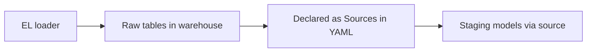
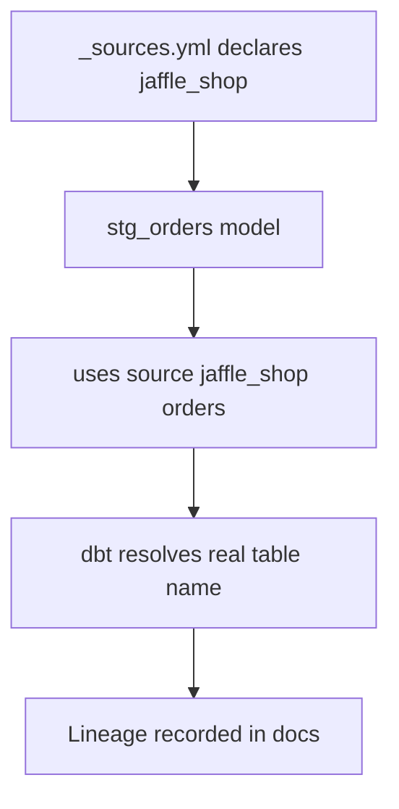

# Sources & the source() Function

*Part of [[dbt-data-build-tool-moc|dbt (Data Build Tool)]] · [[data-pipelines-moc|Data Pipelines]]*

← Prev: [[models-the-ref-function|Models & the ref() Function]] · Next: [[materializations|Materializations]] →

---

## Recap — where we just were

In the last lesson you learned to wire models together with `ref()`. One model calls `ref('other_model')`, and dbt builds them in the right order. That makes a chain.

But every chain has to **start** somewhere. `ref()` only points at tables that dbt itself built. The very first link is different: it points at **raw data** that something else loaded. That raw data is what **sources** declare.

---

## Level 1 — The big idea

A **source** is a YAML declaration of the raw tables already sitting in your warehouse. "Raw" means a table that some loading tool dumped in — dbt did **not** build it.

A quick reminder of **ELT** (Extract, Load, Transform): an **EL tool** first *extracts* data from an app and *loads* it into the warehouse as raw tables. dbt does the *transform* step afterwards. Sources are how dbt points back at those raw tables.

**Analogy:** sources are labelled "inbox" trays where outside deliveries land. The `source()` function is you pointing at one specific tray. (We will meet **freshness** soon — that is checking the newest item in the tray is recent.)



So the data flows: a loader fills raw tables, you declare those tables as sources, and your first models read from them through `source()`.

---

## Level 2 — How it actually works

You write a YAML file, usually `models/staging/_sources.yml`. In it you give the group of raw tables a **source name** and list each **table** inside it.

Then, in a staging model, instead of typing the raw table name by hand, you call `source('source_name', 'table_name')`. dbt swaps that for the real, fully-qualified table name when it runs.

`source()` is to raw tables what `ref()` is to models. Both do two jobs:

1. They return the correct table name (database and schema included).
2. They record **lineage** — the recorded trail of where each piece of data came from.

You get three benefits:

- **Lineage:** the docs graph shows data flowing out of raw sources into your models.
- **One place to change names:** if the raw schema is renamed, you edit the YAML once, not every model.
- **Freshness checks:** you can ask dbt whether the raw load is recent.



Rule of thumb: a staging model should select from `source()`, never from a hard-coded raw table name.

---

## Level 3 — See it with real numbers

Here is a `_sources.yml`. It declares one source named `jaffle_shop` with two tables, and adds a **freshness** rule on a `loaded_at` column.

The `loaded_at_field` tells dbt which column holds the load timestamp. `warn_after` and `error_after` set the limits.

```yaml
version: 2

sources:
  - name: jaffle_shop
    database: raw
    schema: jaffle_shop
    loaded_at_field: loaded_at
    freshness:
      warn_after:
        count: 12
        period: hour
      error_after:
        count: 24
        period: hour
    tables:
      - name: orders
      - name: customers
```

A staging model then reads from the source instead of the raw name:

```sql
-- models/staging/stg_orders.sql
select
    id as order_id,
    customer_id,
    order_date,
    status
from {{ source('jaffle_shop', 'orders') }}
```

Now run the freshness check:

```sql
dbt source freshness
```

dbt looks at the newest `loaded_at` value and compares it to "now". Suppose the newest row was loaded **30 hours ago**.

- 30 hours is more than `warn_after` (12) → past the warning line.
- 30 hours is more than `error_after` (24) → past the error line.

Since `error_after` is 24 and 30 > 24, dbt reports an **ERROR**:

```
1 of 2 START freshness of jaffle_shop.orders
1 of 2 ERROR STALE freshness of jaffle_shop.orders [ERROR in 0.4s]
Max loaded_at is 30 hours old (error_after 24 hours)
```

The numbers add up: 12 < 24 < 30, so it crosses both lines and lands on ERROR.

---

## Level 4 — In the real world & common traps

**Named use case:** A nightly sync runs through a tool like **Fivetran** (a managed EL service). One night the orders connector breaks and loads nothing. Without a freshness check, dashboards keep showing yesterday's numbers and nobody notices. With `dbt source freshness` scheduled, the 30-hour-old data trips the error and the team gets alerted *before* stale numbers reach the dashboard. This echoes the freshness idea from [[data-quality-validation|Data Quality & Validation]].

**People think: "Sources are the same as ref() models."**
Actually: sources point at **raw** tables that an EL tool loaded. dbt did not build them. `ref()` points at tables dbt **did** build. Different starting points.

**People think: "Just query the raw table name directly in a model."**
Actually: that works once, then breaks the moment the raw schema is renamed, and it hides the data's origin. Declaring a source gives you lineage, freshness, and one-place renaming.

**People think: "Source freshness checks my models."**
Actually: no. Freshness checks the **raw source** load time only. It asks "is the incoming data recent?" — not "did my transformations run?"

---

## Level 5 — Expert view

`source()` and `ref()` look alike but mean different things.

| Aspect | `source('name', 'table')` | `ref('model_name')` |
|---|---|---|
| Points at | A raw table | A model dbt built |
| Who created the table | An EL loader \| outside dbt | dbt itself |
| Declared in | A `_sources.yml` file | A `.sql` model file |
| Supports freshness | Yes \| `dbt source freshness` | No |
| Position in pipeline | The start of the chain | The middle or end |

**Trade-off:** sources cost a little YAML upkeep. You must keep the declaration in step with the real raw tables. In return you get reliable lineage, single-point renaming, and freshness alerts that catch broken loads early. For any pipeline that feeds real dashboards, that trade is worth it.

---

## Check yourself

**Memory hook:** *source() is ref() for raw data — it points at the inbox tray and can check the tray is fresh.*

**Q1: What is a source, and who builds the table it points at?**
A: A source is a YAML declaration of a raw table in the warehouse. An EL loader builds the table, not dbt.

**Q2: A freshness rule has warn_after 12 hours and error_after 24 hours. The newest row is 30 hours old. What does dbt report?**
A: An ERROR, because 30 is greater than 24 (the error limit).

**Q3: Why use source() in a staging model instead of typing the raw table name?**
A: You get lineage in the docs, one place to change the schema name, and freshness checks — none of which a hard-coded name gives you.

---

## Connects to

- [[models-the-ref-function|Models & the ref() Function]] — the sibling function for tables dbt built.
- [[data-quality-validation|Data Quality & Validation]] — where the freshness idea comes from.
- [[dbt-projects-profiles-targets|dbt Projects, Profiles & Targets]] — sources live inside the dbt project structure.

---

## Coming up next

You now know how data enters a dbt project through sources. Next we look at **how dbt stores the results** of a model — as a view, a table, and more — in [[materializations|Materializations]].
