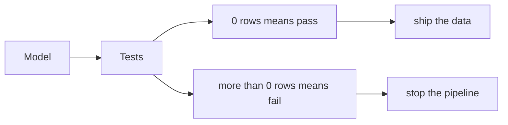
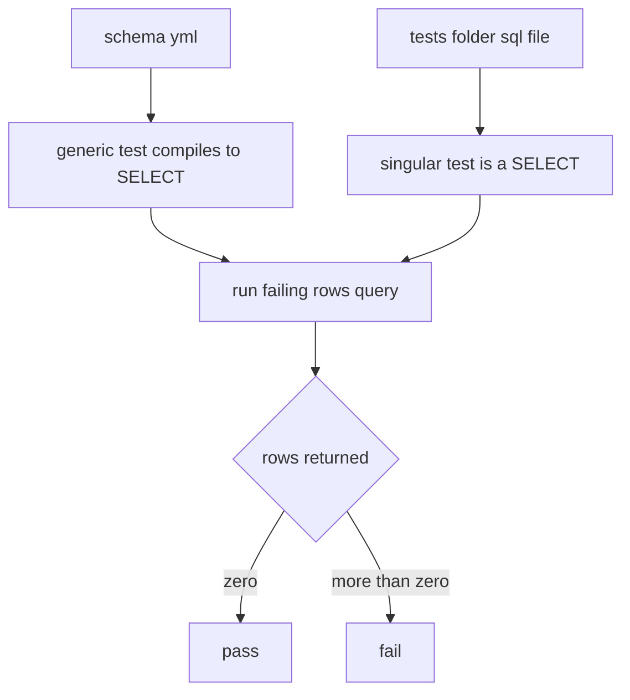

# Tests

*Part of [[dbt-data-build-tool-moc|dbt (Data Build Tool)]] · [[data-pipelines-moc|Data Pipelines]]*

← Prev: [[snapshots-scd-type-2|Snapshots & SCD Type 2]] · Next: [[documentation-lineage|Documentation & Lineage]] →

## Recap — where we just were

In [[snapshots-scd-type-2|Snapshots & SCD Type 2]] you learned to capture history: as a row changes over time, a snapshot keeps the old versions instead of overwriting them. So now you can build data, store it, and historise it.

But there is a missing step. You can build something and still be wrong. A join might duplicate rows. A column you promised was unique might have repeats. Before data reaches a dashboard a real person will trust, you need to **prove it is correct**. That is the job of dbt tests.

---

## Level 1 — The big idea

A dbt test is an **assertion** about your data. An assertion is a claim that should always be true. For example: "every `order_id` is unique" or "no `customer_id` is missing."

Think of tests as **quality inspectors on an assembly line**. Each inspector asks one yes/no question about the product. If any inspector says "no," the line stops before the defect ships.

Here is the clever part. Every dbt test is really a query that looks for **bad rows**. The rule is simple:

- The query returns **0 rows** → nothing is wrong → **pass**.
- The query returns **more than 0 rows** → those are the failures → **fail**.



You run them all with one command: `dbt test`. If a test fails, dbt tells you exactly which check broke and how many rows broke it.

---

## Level 2 — How it actually works

dbt has two kinds of tests.

**Generic tests** (also called schema tests) are one-line checks you declare in YAML, right next to the model, attached to a column. They are reusable and parameterised, so you write the rule once and dbt applies it. The four built-in generic tests are:

- `unique` — no value in the column repeats.
- `not_null` — no value is missing.
- `accepted_values` — every value must be in a list you give.
- `relationships` — every value must exist in another model's column. This is a **foreign-key check**, the idea from [[tables-keys-sql-basics|Tables, Keys & SQL Basics]]: a value here must point to a real row over there.

**Singular tests** are a `.sql` file you drop in the `tests/` folder. The file is a single `SELECT` that returns the **bad rows**. Same rule as before: 0 rows means the test passes. Use these when a check is too specific to express as a one-liner.

Under the hood both kinds are the same thing. Even a `unique` generic test compiles down to a `SELECT` that returns failing rows. Generic tests are just templates that write that query for you; singular tests are the query written by hand. You can even create your own generic tests by writing a **test macro**, reusing the Jinja idea from earlier lessons.



Each test has a **severity**: `warn` or `error`. A `warn` logs the problem but lets the run continue. An `error` is a hard stop — it blocks downstream work. That blocking is enforced most strictly by the `dbt build` command in [[the-dbt-build-workflow|The dbt build Workflow]], which runs and tests models together and refuses to keep going past a broken model.

---

## Level 3 — See it with real numbers

Say you have a fact table `fct_orders` and a dimension `dim_customers` (the [[star-schema|Star Schema]] shape). You want three guarantees: `order_id` is never missing, `order_id` is unique, and every `customer_id` points to a real customer.

You declare all three as generic tests in a `schema.yml` file:

```yaml
version: 2

models:
  - name: fct_orders
    columns:
      - name: order_id
        tests:
          - not_null
          - unique
      - name: customer_id
        tests:
          - relationships:
              to: ref('dim_customers')
              field: customer_id
```

When you run `dbt test`, the `unique` test compiles to a query that finds duplicate keys. Conceptually it does this:

```sql
select
    order_id,
    count(*) as n
from fct_orders
group by order_id
having count(*) > 1
```

Any `order_id` that appears more than once shows up here. If this returns 0 rows, the column really is unique and the test passes.

Now a **singular test**. Revenue should never be negative. Create `tests/assert_positive_revenue.sql`:

```sql
select
    order_id,
    revenue
from {{ ref('fct_orders') }}
where revenue < 0
```

Suppose `fct_orders` has **500,000 rows**. The query finds **312** rows with negative revenue. So the test returns 312 rows. Since 312 is more than 0, the test **fails**, and dbt reports "312 failures." That is exactly the kind of gate you met in [[data-quality-validation|Data Quality & Validation]] — a rule that catches bad data and refuses to wave it through.

The arithmetic: 312 bad rows out of 500,000 is about 0.06% of the table. Tiny, but enough to throw off a revenue total, and `dbt test` flags it instead of letting it slide.

---

## Level 4 — In the real world & common traps

**Named use case: catching a fan-out join.** You join `orders` to `order_items` to add product details. By mistake the join key is not unique on the right side, so each order row gets multiplied — a "fan-out." One order with 3 items becomes 3 order rows. Revenue gets summed 3 times, and a dashboard reports triple the real money. A single `unique` test on `order_id` in the final model catches this immediately: the duplicates make the query return rows, the test fails, and the bad numbers never reach the dashboard.

**People think: "dbt tests check that my SQL is correct, like unit tests."**
Actually: they assert on the **data the SQL produced**, not on the code itself. This is related to but different from [[automated-testing|Automated Testing]], where a unit test checks a function's logic with fixed inputs. A dbt test could pass today and fail tomorrow because new bad data arrived, even though no code changed.

**People think: "All tests passing means the data is perfect."**
Actually: passing only means the assertions **you actually wrote** held. If you never tested for negative revenue, dbt will not catch it. Tests cover exactly the questions you thought to ask, no more.

**People think: "Tests are an optional nice-to-have."**
Actually: they are the safety net that stops bad data reaching users. Skipping them means your first warning of a problem is an angry message about a wrong dashboard. Tests turn that into an automatic, early failure — the whole point of [[data-quality-validation|Data Quality & Validation]].

---

## Level 5 — Expert view

Generic and singular tests trade off reuse against flexibility.

| Aspect | Generic test | Singular test |
| --- | --- | --- |
| Where it lives | YAML next to the model | A `.sql` file in `tests/` |
| Reusable | Yes, parameterised | No, one specific check |
| Best for | Common rules like unique, not_null | Odd, model-specific logic |
| Effort to add | One line | A full query |

It also helps to see where dbt tests sit among the other safety tools you have met.

| Tool | What it asserts | Where it lives |
| --- | --- | --- |
| dbt tests | The **data** is valid right now | Beside dbt models |
| [[automated-testing|Automated Testing]] | The **code logic** is correct | In the code repo |
| [[data-quality-validation|Data Quality & Validation]] | **Pipeline gates** pass before release | Across the whole pipeline |

The `relationships` and `unique` tests are really enforcing the **key** rules from [[tables-keys-sql-basics|Tables, Keys & SQL Basics]], and a stable, non-contradictory dataset echoes the consistency idea from [[transactions-acid|Transactions & ACID]].

The core trade-off: more tests give more confidence, but they cost something. Every test is another query, so runs get **slower**, and every test is code someone must **maintain** as the data evolves. Test the things that would hurt most if they broke — keys, foreign keys, critical totals — rather than asserting everything blindly.

---

## Check yourself

**Memory hook:** *Zero rows means pass. Every test is just a hunt for bad rows.*

**Q1: What does it mean when a dbt test returns more than 0 rows?**
A: It fails. The returned rows are the bad records that broke the assertion. 0 rows means pass.

**Q2: What is the difference between a generic and a singular test?**
A: A generic test is a reusable, parameterised one-line check declared in YAML on a column (like `unique` or `not_null`). A singular test is a custom `.sql` file in `tests/` that selects the bad rows for one specific case.

**Q3: Why is "all my tests pass" not the same as "my data is perfect"?**
A: Tests only check the assertions you actually wrote. Any problem you never thought to test for can still slip through undetected.

---

## Connects to

- [[automated-testing|Automated Testing]] — tests code logic, where dbt tests test the resulting data.
- [[data-quality-validation|Data Quality & Validation]] — the broader idea of gates that block bad data.
- [[tables-keys-sql-basics|Tables, Keys & SQL Basics]] — the keys and foreign keys that `unique` and `relationships` enforce.

---

## Coming up next

Your data is now built, historised, and proven correct. Next you make it understandable to other people: auto-generated docs and a map of how every model depends on the others, in [[documentation-lineage|Documentation & Lineage]].
