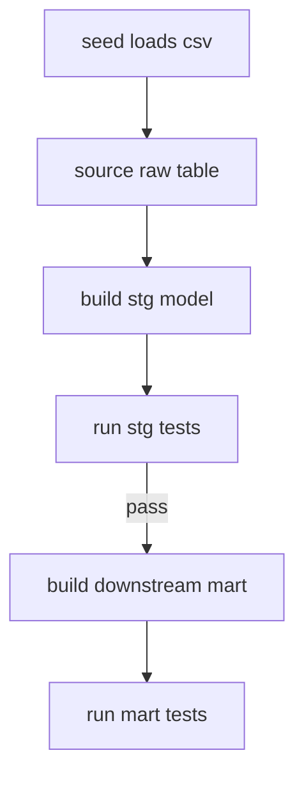
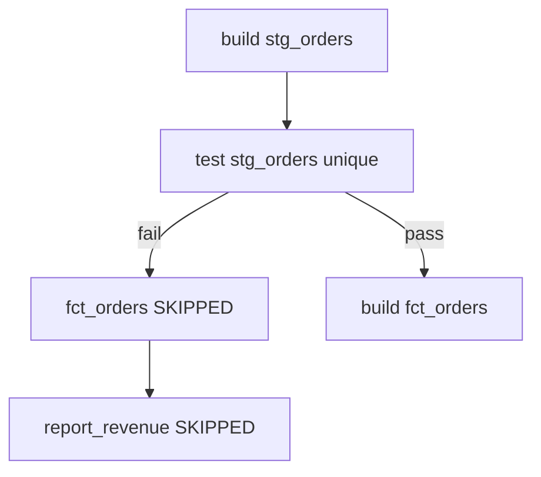

# The dbt build Workflow

*Part of [[dbt-data-build-tool-moc|dbt (Data Build Tool)]] · [[data-pipelines-moc|Data Pipelines]]*

← Prev: [[documentation-lineage|Documentation & Lineage]] · Next: [[deployment-environments-ci|Deployment, Environments & CI]] →

---

## Recap — where we just were

In [[documentation-lineage|Documentation & Lineage]] you learned to see the whole **DAG**: every model, what it depends on, and how data flows from raw sources to final marts. A **DAG** (directed acyclic graph) is just a map of "this must run before that."

Seeing the graph is one thing. Running it correctly is another. This lesson is about one command that runs the whole graph in the right order, and checks the data as it goes.

---

## Level 1 — The big idea

dbt has separate commands for separate jobs:

- `dbt run` builds your models (turns SQL into tables and views).
- `dbt test` runs your data tests.
- `dbt snapshot` runs snapshots (history tracking).
- `dbt seed` loads small CSV files into the warehouse.

The old habit was: run everything, then test everything. That has a hidden flaw. `dbt run` builds **all** models first. So a model far downstream can be built on top of data that a test would have rejected. The bad data has already flowed through before any test catches it.

`dbt build` fixes this. It does run, test, snapshot, and seed **together, in DAG order**. For each model it builds the model, then immediately runs that model's tests. If a test fails, dbt refuses to build the models that depend on it.

Think of building a house. Run-then-test means building the whole house, then inspecting at the very end. `dbt build` inspects each floor before adding the next one. A failed inspection stops you stacking floors on a broken base.



---

## Level 2 — How it actually works

dbt already knows the order from `ref()` and `source()`. Each `ref('stg_orders')` tells dbt that this model depends on `stg_orders`, so `stg_orders` must run first. That dependency map is the **DAG** from [[dags-schedulers|DAGs & Schedulers]] and [[models-the-ref-function|Models & the ref() Function]].

`dbt build` walks that DAG node by node. For each node it does two steps, interleaved:

1. Build the node (the model, snapshot, or seed).
2. Run the tests attached to that node right away.

If a test on a node fails, every node **downstream** of it is marked **skipped**. dbt does not even try to build them. This is the "fail fast" idea from [[data-quality-validation|Data Quality & Validation]], but now enforced across the entire graph, not just at one model.

The diagram below shows both paths: if `stg_orders` fails its test, every node after it is blocked; if it passes, the build continues.



Because build interleaves, the broken data never reaches `fct_orders`. With separate run-then-test, `fct_orders` would already be built before the test ran.

---

## Level 3 — See it with real numbers

Imagine a tiny project with four models in a single chain:

`stg_orders` → `fct_orders` → `report_revenue`, plus `stg_customers` feeding `fct_orders`.

We only want to run `stg_orders` and everything downstream of it. The `+` after a model name means "this model plus all its downstream children."

```bash
$ dbt build --select stg_orders+

Running with dbt
Found 4 selected nodes

1 of 4 START sql table model stg_orders ........ [RUN]
1 of 4 OK   created table model stg_orders ..... [SUCCESS]
2 of 4 START test unique_stg_orders_order_id ... [RUN]
2 of 4 FAIL 3 unique_stg_orders_order_id ....... [FAIL 3]
3 of 4 SKIP relation fct_orders ................ [SKIP]
4 of 4 SKIP relation report_revenue ............ [SKIP]

Finished running 1 table model, 1 test in 4.10s

Completed with 1 error and 0 warnings

Done. PASS=1 WARN=0 ERROR=1 SKIP=2 TOTAL=4
```

Read the final line. 4 nodes were selected. 1 model built fine (`PASS=1`). 1 test failed because there were 3 duplicate order IDs (`ERROR=1`). Because that test failed, the 2 downstream models were skipped (`SKIP=2`). The numbers add up: 1 + 1 + 2 = 4.

Notice what did **not** happen: `fct_orders` was never built. No duplicate orders leaked into the revenue report. If you had run `dbt run` then `dbt test`, all three models would have been built first, and you would only learn about the duplicates afterward, with bad numbers already sitting in `report_revenue`.

To rebuild incremental models from scratch instead of just adding new rows, you add `--full-refresh`.

---

## Level 4 — In the real world & common traps

Named use case: a **CI** check on a pull request. CI (continuous integration) is an automated job that runs when you open a [[code-review-pull-requests|Code Review & Pull Requests]] request. You do not want to rebuild the whole warehouse for a one-line change. So the job runs:

```bash
dbt build --select state:modified+
```

`state:modified+` means "only the models that changed in this branch, plus everything downstream of them." dbt compares your branch against a saved snapshot of the project state. The CI job builds and tests just that affected slice, fast, and blocks the merge if any test fails.

**People think: "dbt build is just an alias for dbt run."**
Actually: build also runs tests, snapshots, and seeds, and it gates downstream models on test results. `dbt run` only builds models and never tests anything.

**People think: "run then test is equivalent to build."**
Actually: run-then-test builds every model first, so bad data flows all the way through before a test ever runs. build stops the bad data mid-DAG by testing each node before its children are built.

**People think: "you must build the entire project every time."**
Actually: selectors like `--select stg_orders+`, `tag:nightly`, or `state:modified+`, and `--exclude`, let you run just the subset you need.

---

## Level 5 — Expert view

The default-safe choice is `dbt build`. Running steps separately gives finer control but loses the automatic gate.

| Command | What it does | Gates downstream on a failed test? |
| --- | --- | --- |
| `dbt build` | Runs models, [[tests\|Tests]], snapshots and seeds in DAG order, interleaved | Yes — skips children of a failed node |
| `dbt run` | Builds models only | No — builds everything, tests nothing |
| `dbt test` | Runs tests only, after models already exist | No — by then models are built |
| `dbt seed` / `dbt snapshot` | Loads seeds / records snapshots only | No — single step, no model gating |

Trade-offs:

- `dbt build` is the safe default. One command, correct order, and bad data cannot cross a failed test. The cost: less granular control, and you usually want it driven by the DAG order from [[dags-schedulers|DAGs & Schedulers]].
- Separate commands give precision (rebuild just models, or just re-run tests on existing tables) but you give up the automatic gating, so a human must remember to test before trusting downstream data. That is exactly the gap [[data-quality-validation|Data Quality & Validation]] warns about.

For most production runs and CI, use `build`. Reach for the separate commands only when you have a specific reason, like re-running tests without rebuilding.

---

## Check yourself

**Memory hook:** *build inspects each floor before stacking the next — a failed test stops the build above it.*

**Q1: Why can `dbt run` then `dbt test` let bad data through?**
A: `dbt run` builds every model first, so downstream models are already built on the bad data before any test runs. The test catches it too late.

**Q2: In the Level 3 example, why were 2 models skipped?**
A: The `unique` test on `stg_orders` failed. Because `dbt build` gates the DAG, the 2 models downstream of `stg_orders` were skipped instead of built on top of bad data.

**Q3: What does `state:modified+` select, and why is it used in CI?**
A: It selects the models changed in your branch plus everything downstream of them. CI uses it to build and test only the affected slice quickly, instead of the whole project.

---

## Connects to

- [[tests|Tests]] — the checks that `build` runs against each node.
- [[dags-schedulers|DAGs & Schedulers]] — the order `build` walks.
- [[data-quality-validation|Data Quality & Validation]] — the fail-fast principle build enforces.
- [[deployment-environments-ci|Deployment, Environments & CI]] — where `state:modified+` builds run automatically.

---

## Coming up next

You can now run the whole graph safely with one command. Next, in [[deployment-environments-ci|Deployment, Environments & CI]], you will see where these `build` commands actually run: dev versus production environments, and the CI pipeline that runs them on every pull request.
