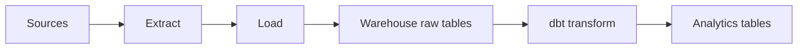
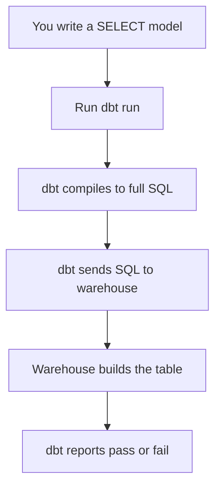

# What dbt Is & the T in ELT

*Part of [[dbt-data-build-tool-moc|dbt (Data Build Tool)]] · [[data-pipelines-moc|Data Pipelines]]*

← Prev: [[data-quality-validation|Data Quality & Validation]] · Next: [[dbt-projects-profiles-targets|dbt Projects, Profiles & Targets]] →

---

## Recap — where we just were

In [[data-quality-validation|Data Quality & Validation]] you saw how pipelines gate bad data before anyone trusts it. dbt brings that same discipline to the next step: *transforming* raw data into clean, useful tables.

---

## Level 1 — The big idea

**dbt** stands for **data build tool**. It is a tool that turns raw tables in your data warehouse into clean, ready-to-use tables. A **data warehouse** is a big database built for analytics, like **Snowflake** or **BigQuery**.

To understand dbt, you first need **ELT**. The letters stand for three steps:

- **Extract** — pull data out of a source, like an app database.
- **Load** — drop that raw data into the warehouse.
- **Transform** — reshape it into tables people can query.

The old way was **ETL**: transform the data *before* loading it. Modern warehouses are so powerful that we flip the last two steps. We **load raw data first**, then **transform it inside the warehouse**. That is **ELT**.

dbt only does the **T**. It does not extract. It does not load. It does not move data between systems. Separate **EL** tools, like **Fivetran** or **Airbyte**, handle the Extract and Load.

**Analogy.** Think of the warehouse as a kitchen with a big fridge. Other tools deliver raw ingredients (raw tables) into the fridge. dbt is the recipe book *and* the chef. It reads the recipes and turns ingredients into finished dishes (analytics tables). dbt does not drive the delivery truck. It only cooks.



---

## Level 2 — How it actually works

Here is the surprising part: dbt does not run your data. Your warehouse does. dbt is a **compiler and runner** for analytics SQL. It writes SQL, hands it to the warehouse, and the warehouse does the heavy lifting.

The core idea is simple. You write a `SELECT` statement that describes the table you want. dbt wraps that `SELECT` in a `CREATE TABLE AS` or `CREATE VIEW AS` command and sends it to the warehouse.

Step by step:

1. You write a **model** — a file holding one `SELECT` statement.
2. You run a command, `dbt run`.
3. dbt reads your model and **compiles** it into full warehouse SQL.
4. dbt sends that SQL to the warehouse over a connection.
5. The warehouse runs it and builds the table or view.
6. dbt reports which models passed or failed.

dbt itself is not a database. It stores no rows. It is a thin layer that generates SQL and tracks the order to run things.

The real value is that dbt brings **software engineering** habits to SQL. Before dbt, analytics SQL was often a pile of scripts no one could trust. dbt adds:

- **Version control** — track every change. See [[version-control-with-git|Version Control with Git]].
- **Modularity** — split one giant query into small models that build on each other.
- **Testing** — check your data with rules. See [[tests|Tests]].
- **Documentation** — describe each table and column.

Two versions exist. **dbt Core** is the free, open-source command-line tool you run yourself. **dbt Cloud** is a hosted, paid version with a web interface and a built-in scheduler. The SQL logic is the same in both.



---

## Level 3 — See it with real numbers

Imagine a raw **events** table. Every tap, click, and page view from an app lands here. It holds **10,000,000 rows**, one per event, across one year of activity.

You want a small summary table: **daily_active_users** — how many distinct users were active each day. Your app ran for a full non-leap year, so that is **365 days**, giving **365 rows**.

You write this model file, `daily_active_users.sql`:

```sql
SELECT
    CAST(event_time AS DATE) AS activity_date,
    COUNT(DISTINCT user_id)  AS active_users
FROM raw.events
GROUP BY CAST(event_time AS DATE)
```

When you run `dbt run`, dbt compiles your `SELECT` into a full command. With the default **table** setting, it produces:

```sql
CREATE TABLE analytics.daily_active_users AS
SELECT
    CAST(event_time AS DATE) AS activity_date,
    COUNT(DISTINCT user_id)  AS active_users
FROM raw.events
GROUP BY CAST(event_time AS DATE)
```

Run it and check the math:

```bash
$ dbt run --select daily_active_users
1 of 1 OK created table model analytics.daily_active_users
Done. PASS=1 WARN=0 ERROR=0 SKIP=0 TOTAL=1
```

The result:

- **Input:** 10,000,000 event rows.
- **Step:** group by date, count distinct users per day.
- **Output:** 365 rows, one per day of the year.

So 10,000,000 raw rows collapse into 365 summary rows. That is a **27,397-to-1** reduction (10,000,000 ÷ 365 ≈ 27,397). The warehouse did all the counting. dbt only wrote and sent the SQL.

---

## Level 4 — In the real world & common traps

**Real-world use case.** A subscription company loads raw billing and usage data into **Snowflake** every night using **Fivetran**. Their analytics team then uses dbt to build clean tables: active subscribers, monthly revenue, and churn. The dashboards everyone trusts are built on dbt models, version-controlled and tested like real software.

**People think: "dbt moves and loads data into the warehouse."**
Actually: it does not. dbt only transforms data that is *already* in the warehouse. Separate EL tools like **Fivetran** or **Airbyte** do the loading. dbt never copies rows between systems.

**People think: "dbt is a database that stores your tables."**
Actually: dbt stores nothing. Your warehouse holds every row. dbt just generates SQL and the warehouse runs it. Turn off the warehouse and dbt can build nothing.

**People think: "dbt replaces your scheduler or orchestrator."**
Actually: it complements them. dbt knows the *order* to build its own models, but it does not decide *when* to run, or coordinate other tools. An orchestrator still triggers the run. See [[dags-schedulers|DAGs & Schedulers]].

---

## Level 5 — Expert view

dbt is often confused with neighbouring tools. Here is how it differs.

| Concept | What it does | Where work runs | When it acts |
|---|---|---|---|
| **dbt** | Transforms data already in the warehouse \| Inside the warehouse \| When triggered, in batches |
| **Traditional ETL tool** | Extracts, transforms, *and* loads \| On its own servers \| Often before loading |
| **Orchestrator** ([[dags-schedulers|DAGs & Schedulers]]) | Schedules and coordinates many jobs \| Controls other tools \| On a timetable |

A few trade-offs and edge cases:

- dbt is **batch-oriented**. It rebuilds tables on a schedule, not row-by-row as data arrives. For low-latency needs, see [[batch-vs-streaming|Batch vs Streaming]].
- dbt depends entirely on your warehouse. If warehouse compute is slow or costly, dbt cannot fix that — it only sends the SQL.
- dbt shines for **transformation logic**, not ingestion or orchestration. A full stack usually pairs an EL tool, dbt, and an orchestrator together.
- Because dbt generates plain SQL, you can read exactly what it sends. There is no hidden engine. That makes it easy to debug and review.

---

## Check yourself

**Memory hook:** *dbt is the T in ELT — the chef in the warehouse kitchen, never the delivery truck.*

**Q1: What does dbt do, and what does it not do?**
A: It transforms data that is already in the warehouse by generating SQL. It does not extract, load, or move data between systems.

**Q2: If dbt is not a database, what actually builds your tables?**
A: Your data warehouse. dbt compiles a `SELECT` into a `CREATE TABLE AS` command and the warehouse runs it.

**Q3: Why is the modern pattern ELT instead of ETL?**
A: Modern warehouses are powerful enough to transform data after loading, so you load raw data first and transform it in place, rather than transforming before the load.

---

## Connects to

[[tables-keys-sql-basics|Tables, Keys & SQL Basics]] · [[star-schema|Star Schema]] · [[dags-schedulers|DAGs & Schedulers]] · [[batch-vs-streaming|Batch vs Streaming]]

---

## Coming up next

Now that you know *what* dbt is, you need to set up your own dbt project. Next, [[dbt-projects-profiles-targets|dbt Projects, Profiles & Targets]] shows how a project is laid out and how dbt connects to your warehouse — the groundwork before you write your first real model.
