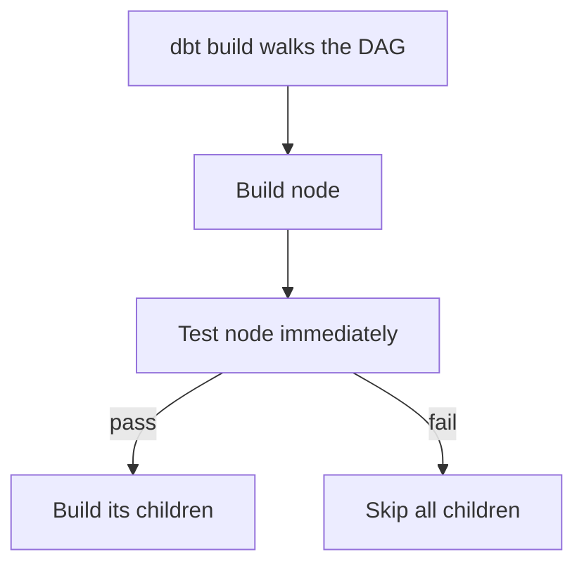
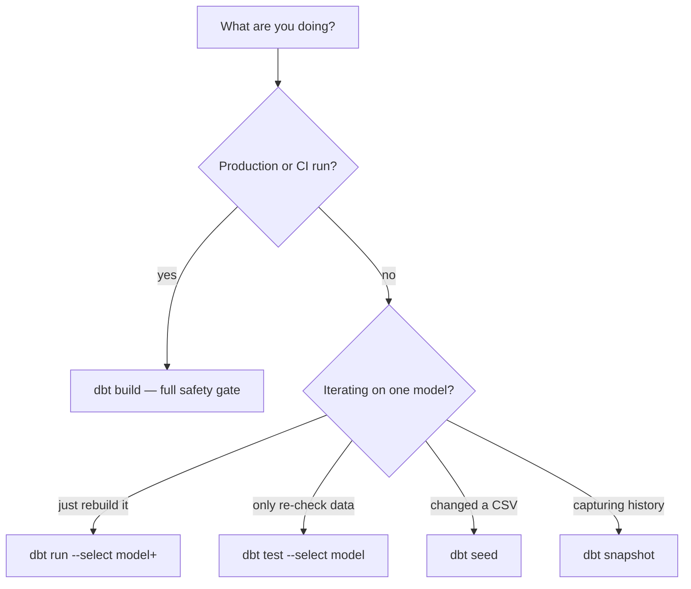

# dbt Commands: run vs build vs test (and when)

*Part of [[dbt-data-build-tool-moc|dbt (Data Build Tool)]] · [[data-pipelines-moc|Data Pipelines]]*

*Synthesized companion · see [[synthesized-moc|Synthesized Notes]]*

---

dbt has a handful of commands that are easy to mix up — `run`, `test`, `build`, `seed`,
`snapshot`. This note is a decision guide: what each one does, why `dbt build` is the safe
default, and how selectors let you run just the slice you need. It draws mainly on the build
workflow and deployment lessons.

---

## The core commands at a glance

| Command | What it does | Runs tests? | Gates downstream on a failed test? |
|---|---|---|---|
| `dbt build` | runs models, tests, snapshots **and** seeds in DAG order, interleaved | yes | **yes** — skips children of a failed node |
| `dbt run` | builds models only | no | no |
| `dbt test` | runs tests against models that already exist | yes | no — models are already built |
| `dbt seed` | loads CSV seeds into the warehouse | no | no |
| `dbt snapshot` | records SCD Type 2 snapshots | no | no |

The key insight: `dbt build` is **not** an alias for `dbt run`. `run` builds every model first
and tests nothing, so bad data can flow all the way to your marts before any test catches it.
`build` tests each node right after building it and **skips everything downstream of a
failure** — so broken data never reaches the tables analysts read. ([[the-dbt-build-workflow|The dbt build Workflow]])



That "fail fast" gate is the whole reason to prefer `build`. ([[tests|Tests]], [[the-dbt-build-workflow|The dbt build Workflow]])

---

## Which command in which situation



| Situation | Command | Why |
|---|---|---|
| Scheduled production refresh | `dbt build --target prod` | one command, correct order, test gating, writes to `analytics` |
| CI check on a pull request | `dbt build --select state:modified+ --defer` | builds only changed models + downstream (slim CI) |
| Local: rebuild one model and its children | `dbt run --select my_model+` | fast iteration, no need to test yet |
| Local: re-run tests without rebuilding | `dbt test --select my_model` | tables already exist; just re-check |
| Changed seed CSV | `dbt seed` | reloads the file as a table |
| First-time / schema change on incremental | `dbt run --full-refresh` | drops and rebuilds from scratch |
| Verify warehouse connection | `dbt debug` | checks profile + login before building |
| Build the docs site | `dbt docs generate` then `dbt docs serve` | descriptions + lineage graph |

For most production and CI runs, reach for `build`. Use the separate commands only when you
have a specific reason — like re-running tests on tables that already exist.
([[deployment-environments-ci|Deployment, Environments & CI]])

---

## Selectors — running just a slice

You rarely want to build the whole project. Selectors scope a command to part of the DAG:

| Selector | Selects | Example |
|---|---|---|
| `model_name` | just that one node | `dbt run --select stg_orders` |
| `model_name+` | that node **and everything downstream** | `dbt build --select stg_orders+` |
| `+model_name` | that node and everything **upstream** | `dbt build --select +fct_orders` |
| `state:modified+` | models changed vs a saved state, plus downstream | `dbt build --select state:modified+` |
| `tag:nightly` | all models carrying a tag | `dbt run --select tag:nightly` |
| `--exclude ...` | removes nodes from the selection | `dbt build --exclude tag:slow` |

The `+` is the workhorse: `stg_orders+` means "this model plus all its children." In CI,
`state:modified+` is what makes **slim CI** fast — a PR that changes 3 of 200 models, with 5
downstream, builds just **8** models instead of 200. Pairing it with `--defer` lets unchanged
upstream models reuse the already-built prod tables instead of rebuilding them.
([[the-dbt-build-workflow|The dbt build Workflow]], [[deployment-environments-ci|Deployment, Environments & CI]])

---

## Reading the run summary

Every run ends with a tally. Learn to read it at a glance:

```
Done. PASS=1 WARN=0 ERROR=1 SKIP=2 TOTAL=4
```

`PASS` built/tested fine, `WARN` is a `warn`-severity test that didn't block, `ERROR` failed
(here: a `unique` test found duplicates), and `SKIP` counts nodes downstream of the failure
that `build` refused to build. The parts always sum to `TOTAL`. ([[the-dbt-build-workflow|The dbt build Workflow]], [[tests|Tests]])

---

## One-line rule of thumb

> **Default to `dbt build`** — it's the only command that runs *and* tests in order and stops
> bad data mid-DAG. Drop to `run`/`test`/`seed`/`snapshot` only for targeted local work, and
> scope everything with selectors so you never rebuild more than you must.

---

## Sources

- [[the-dbt-build-workflow|The dbt build Workflow]]
- [[deployment-environments-ci|Deployment, Environments & CI]]
- [[models-the-ref-function|Models & the ref() Function]]
- [[tests|Tests]]
- [[incremental-models|Incremental Models]]
- [[documentation-lineage|Documentation & Lineage]]
