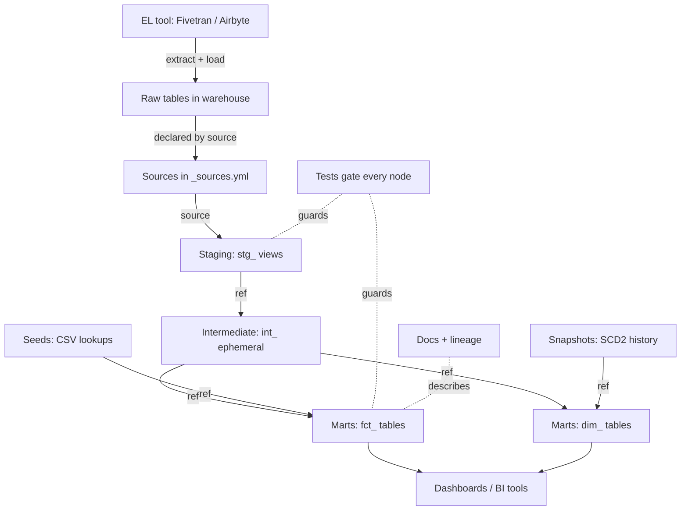
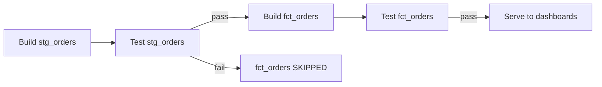

# dbt End-to-End: From Raw Data to Reports

*Part of [[dbt-data-build-tool-moc|dbt (Data Build Tool)]] · [[data-pipelines-moc|Data Pipelines]]*

*Synthesized companion · see [[synthesized-moc|Synthesized Notes]]*

---

The fifteen dbt lessons each teach one piece. This note connects them into a single
picture: how one row of raw data travels from the moment an EL tool drops it in the
warehouse to the moment it appears, clean and trusted, on a dashboard. Read it after the
lessons, as a map of the whole journey.

dbt only owns the **T** in **ELT** — it transforms data that is *already* in the warehouse;
separate EL tools like Fivetran or Airbyte do the Extract and Load. ([[what-dbt-is-the-t-in-elt|What dbt Is & the T in ELT]])

---

## The whole pipeline on one page

Every arrow in that graph is a `ref()` or `source()` call you wrote. dbt reads them all,
assembles a **DAG** (directed acyclic graph), and builds each node only after the nodes it
depends on. ([[models-the-ref-function|Models & the ref() Function]], [[documentation-lineage|Documentation & Lineage]])

---

## Following one row through the layers

| Stage | What happens to the row | dbt feature | Typical materialization |
|---|---|---|---|
| **Load** | An EL tool drops the raw row into the warehouse | (not dbt) | raw table |
| **Source** | You declare that raw table so dbt can point at it and check freshness | `source()` | n/a |
| **Staging** | Light cleaning only — rename columns, cast types, standardise values; one `stg_` model per source table (1:1) | `source()` → model | view |
| **Intermediate** | Business logic that more than one mart shares — e.g. orders joined to line items, computed once | `ref()` | ephemeral / view |
| **Marts** | The final business-facing shape: facts (`fct_`) and dimensions (`dim_`), usually a star schema | `ref()` | table |
| **Serve** | Analysts and BI tools read the marts | — | — |

The golden rule of the layering: **each layer only reads from the layer to its left** — you
never skip backward. That one rule is what keeps a 300-model project navigable.
([[project-structure-staging-intermediate-marts|Project Structure: Staging, Intermediate & Marts]])

The marts at the end are deliberately **denormalized** into a [[star-schema|Star Schema]] so
analytics queries need fewer joins — the opposite of an app database.

---

## Where the supporting pieces plug in

The straight line raw → staging → marts is the spine. Four other features hang off it:

- **Seeds** — small static CSV lookups you author and check into git (country codes, status
  labels). Loaded with `dbt seed`, then joined into marts via `ref()`.
  ([[seeds|Seeds]])
- **Snapshots** — capture how a *mutable* source row changes over time (SCD Type 2), so a
  customer's free→paid history is preserved instead of overwritten. These feed time-aware
  dimensions. ([[snapshots-scd-type-2|Snapshots & SCD Type 2]])
- **Tests** — assertions that every node is correct (`unique`, `not_null`, `relationships`,
  plus custom checks). A test is just a query for bad rows: 0 rows = pass. ([[tests|Tests]])
- **Documentation & lineage** — descriptions you write in YAML, plus the dependency graph dbt
  derives for free from your `ref()`/`source()` calls. ([[documentation-lineage|Documentation & Lineage]])

---

## How it all gets built — and stays correct

One command walks the whole DAG: `dbt build` runs models, tests, snapshots, and seeds
**interleaved in dependency order**. It builds a node, immediately tests it, and **skips
everything downstream if a test fails** — so bad data never reaches the marts. This is the
"fail fast" guarantee that ties the whole pipeline together. ([[the-dbt-build-workflow|The dbt build Workflow]])

In production that same `dbt build` runs on a schedule against the shared `analytics` schema,
and a slimmed-down version runs in CI on every pull request — so the journey from raw to
reports is both automatic and guarded. ([[deployment-environments-ci|Deployment, Environments & CI]])

---

## The one-sentence summary

> An EL tool **loads** raw rows; dbt **declares** them as sources, **cleans** them in staging,
> **combines** them in intermediate, **shapes** them into star-schema marts, **tests** every
> step, **documents** the lineage, and **builds** the whole graph in order — turning raw data
> into reports a business can trust.

---

## Sources

- [[what-dbt-is-the-t-in-elt|What dbt Is & the T in ELT]]
- [[sources-the-source-function|Sources & the source() Function]]
- [[models-the-ref-function|Models & the ref() Function]]
- [[project-structure-staging-intermediate-marts|Project Structure: Staging, Intermediate & Marts]]
- [[seeds|Seeds]]
- [[snapshots-scd-type-2|Snapshots & SCD Type 2]]
- [[tests|Tests]]
- [[documentation-lineage|Documentation & Lineage]]
- [[the-dbt-build-workflow|The dbt build Workflow]]
- [[deployment-environments-ci|Deployment, Environments & CI]]
- [[star-schema|Star Schema]]
