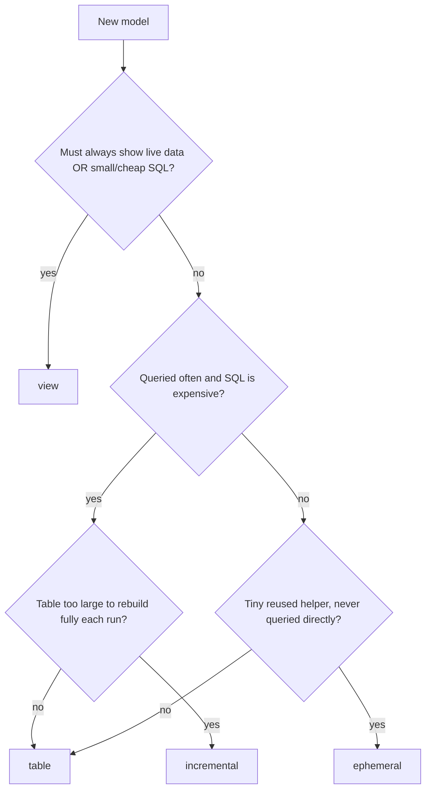

# dbt Materializations — When to Use Which

*Part of [[dbt-data-build-tool-moc|dbt (Data Build Tool)]] · [[data-pipelines-moc|Data Pipelines]]*

---

A **materialization** is the strategy dbt uses to persist a model's result in the database. You write one `SELECT`; the materialization decides what physical object (if any) dbt builds from it. Choosing the right one is a trade-off across four dimensions: **storage used**, **build cost per run**, **read speed**, and **data freshness**. ([[materializations|Materializations]])

---

## The Four Materializations at a Glance

| Materialization | What dbt builds | Storage | Build cost per run | Read speed | Freshness |
|---|---|---|---|---|---|
| `view` | `CREATE VIEW` — saved query, no rows stored | none | tiny (just defines the query) | slow — SQL re-runs on every read | always live |
| `table` | `CREATE TABLE AS SELECT` — rows stored | full copy | high — full rebuild every run | fast — reads stored rows | as of last run |
| `ephemeral` | nothing in the DB — inlined as a CTE | none | none | n/a — exists only inside parent models | always live |
| `incremental` | table built once, then rows appended/merged | full copy | low — only new rows processed | fast — reads stored rows | as of last run |

Set the materialization with a config block at the top of the model file, or as a folder default in `dbt_project.yml`. If you set nothing, dbt defaults to **view**.

```sql
{{ config(materialized='table') }}
```

([[materializations|Materializations]])

---

## When to Use Each



**`view`** — best for staging models and anything that must reflect live source data. Storage is free and reads stay fresh, but every query re-runs the underlying SQL. If 1,000 dashboard reads each trigger a heavy scan, the compute bill multiplies by 1,000. ([[materializations|Materializations]])

**`table`** — best for heavy marts read repeatedly by dashboards. dbt runs the expensive SQL once per `dbt run` and stores the rows; the 1,000 reads just scan stored rows cheaply. The cost: storage, and data is frozen until the next run. A common pattern: *staging models as views, marts as tables*. ([[materializations|Materializations]])

**`ephemeral`** — best for tiny reusable SQL helpers that you only ever `ref()` inside other models. dbt inlines the SQL as a CTE — no database object is created, so you cannot query it directly in the warehouse. ([[materializations|Materializations]])

**`incremental`** — best for large, append-heavy tables (clickstream, event logs, server logs) where a full rebuild each run is too slow or too expensive. Works like a table but adds only new rows on subsequent runs. ([[incremental-models|Incremental Models]])

---

## How Incremental Models Actually Work

### First run vs. later runs

- **First run** (or `--full-refresh`): `is_incremental()` returns **false**. dbt builds the full table from scratch, reading all source rows.
- **Later runs**: `is_incremental()` returns **true**. dbt evaluates only the filtered `WHERE` clause, pulling just the new rows and inserting or merging them into the existing table.

([[incremental-models|Incremental Models]])

### The high-watermark pattern

The standard filter compares new source rows against the maximum timestamp already stored in the model's own table (`{{ this }}`):

```sql
{{
  config(
    materialized = 'incremental',
    unique_key   = 'event_id'
  )
}}

select
    event_id,
    user_id,
    event_type,
    event_time
from {{ source('app', 'events') }}


where event_time > (select max(event_time) from {{ this }})

```

On the first run the `WHERE` block is absent and all rows load. On subsequent runs dbt reads `max(event_time)` from the target table and fetches only newer rows from the source. ([[incremental-models|Incremental Models]])

### Append vs. merge (the `unique_key` choice)

| Strategy | What it does | Handles updates? | Risk |
|---|---|---|---|
| append (no `unique_key`) | inserts new rows only | no | duplicates on rerun |
| merge (`unique_key` set) | upserts on the key — updates existing rows, inserts new ones | yes | requires a true unique key |

Without `unique_key`, incremental models blindly append — a rerun creates duplicate rows. With `unique_key`, dbt merges, making reruns **idempotent**: running the same build twice produces the same result. ([[incremental-models|Incremental Models]])

### When to force a full rebuild

Run `dbt run --full-refresh` (or `dbt build --full-refresh`) when:
- You add or remove columns (schema change).
- You need to backfill corrected historical data.
- You suspect the incremental filter missed late-arriving rows.

([[incremental-models|Incremental Models]], [[the-dbt-build-workflow|The dbt build Workflow]])

### Scale impact

With 100,000,000 stored rows and 500,000 new rows per day, the incremental run processes **200× less data** than a full rebuild. If the full rebuild takes 200 minutes, the incremental run for the same daily load is roughly 1 minute. ([[incremental-models|Incremental Models]])

---

## Where Materializations Fit in the Build Workflow

`dbt build` runs models, tests, snapshots, and seeds **interleaved in DAG order** — it tests each model immediately after building it, and skips downstream models if a test fails. The materialization only affects the *build* step; the test gating applies regardless of which materialization is chosen. ([[the-dbt-build-workflow|The dbt build Workflow]])

---

## Sources

- [[materializations|Materializations]]
- [[incremental-models|Incremental Models]]
- [[the-dbt-build-workflow|The dbt build Workflow]]
