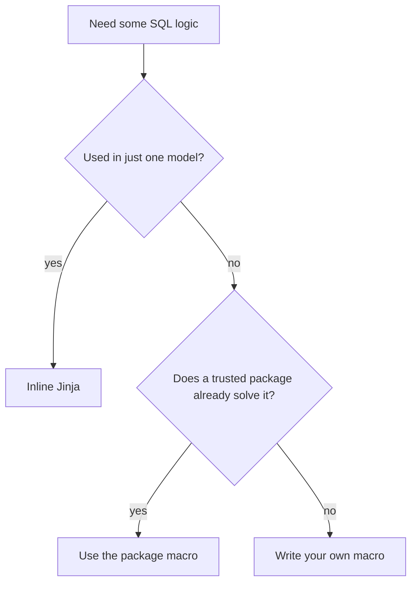

# Reuse in dbt: Inline Jinja vs Macros vs Packages

*Part of [[dbt-data-build-tool-moc|dbt (Data Build Tool)]] · [[data-pipelines-moc|Data Pipelines]]*

*Synthesized companion · see [[synthesized-moc|Synthesized Notes]]*

---

dbt gives you three levels of reuse for SQL logic — inline Jinja, your own macros, and
third-party packages. They form a ladder: each step buys more reuse at the cost of more
indirection. This note is a decision guide for which rung to stand on, drawing on the Jinja
and macros lessons.

All three share one foundation: **Jinja runs at compile time**, before any SQL reaches the
warehouse. Whatever you write — a loop, a macro call, a package helper — is gone by the time
the database sees the query. The database only ever runs plain SQL. ([[jinja-templating-in-dbt|Jinja Templating in dbt]])

---

## The three levels

| Level | What it is | Where it lives | Best for |
|---|---|---|---|
| **Inline Jinja** | loops / `if` / `set` written directly in a model | the model's own `.sql` file | logic specific to one model |
| **Macro** | a named, reusable Jinja function | a `.sql` file in `macros/` | logic repeated across several models |
| **Package** | a shared dbt project of macros (and models/tests) | `dbt_packages/`, after `dbt deps` | solved common problems you shouldn't rewrite |



---

## Level 1 — Inline Jinja

Use inline Jinja when the logic belongs to **one** model. The classic example is a loop that
pivots a list into columns — e.g. turning four payment methods into four `sum(case when ...)`
columns. The loop **unrolls** at compile time into static SQL: 4 items in, 4 columns out, add
a fifth and you get a fifth automatically, without touching the `select` body.
([[jinja-templating-in-dbt|Jinja Templating in dbt]])

Another common inline use is **environment-aware logic** — ``
to cap rows in dev so you don't scan billions of rows while testing.

Debugging habit: read the compiled file in **`target/compiled/`** to see the exact SQL the
warehouse received. That single habit resolves most "what did my Jinja do?" confusion.

---

## Level 2 — Your own macro

Promote inline Jinja to a **macro** the moment the same logic appears in more than one model.
A macro is just a named Jinja function: you define it once in `macros/`, then call it like a
function wherever you need it. ([[macros-packages|Macros & Packages]])

The payoff is the **DRY principle** applied to SQL. If a `cents_to_dollars` rule lives inline
in 12 models and finance changes the divisor, you edit 12 files and hope you found them all.
As a macro the rule lives in **one** place — change one line, all 12 models pick it up. Edits:
12 vs 1; files at risk of a missed copy: 11 vs 0. ([[macros-packages|Macros & Packages]], [[clean-code-refactoring|Clean Code & Refactoring]])

A macro returns a *string of SQL* at compile time — no magic, just text substitution you can
verify in `target/`.

---

## Level 3 — A package

Before writing a macro, ask whether a **package** already solves the problem. A package is a
shared dbt project you install by listing it in `packages.yml` with a **pinned version** and
running `dbt deps`. ([[macros-packages|Macros & Packages]])

```yaml
# packages.yml
packages:
  - package: dbt-labs/dbt_utils
    version: 1.1.1        # pin, never "latest", for reproducibility
```

The most-used package is **dbt_utils** (`generate_surrogate_key`, `star`, `date_spine`,
`pivot`). Others: **dbt_expectations** (extra tests), **codegen** (boilerplate generation),
**dbt_date**. Reusing battle-tested code beats reinventing a surrogate-key or pivot helper and
adding your own bugs. Pinning the version means every teammate and every CI run installs the
*exact* same code. ([[macros-packages|Macros & Packages]])

---

## When to use which — and the anti-pattern

| Reach for… | When… |
|---|---|
| Inline Jinja | the logic is used in exactly one model |
| Your own macro | the same logic repeats across models, and it's specific to your business |
| A package | a common, hard problem already has a trusted solution (surrogate keys, date spines) |

**The over-templating trap.** More Jinja is not better. Deeply nested loops and conditions
make SQL unreadable, and every layer widens the gap between what you wrote and what runs —
which is exactly where bugs hide. Favour clear SQL over clever templates; keep Jinja shallow,
name list variables clearly, and always check the compiled output. ([[jinja-templating-in-dbt|Jinja Templating in dbt]], [[clean-code-refactoring|Clean Code & Refactoring]])

**The dependency cost.** A package gives you proven code for free, but every package is
another version you must track, trust, and eventually upgrade. A pinned version keeps you safe
today, yet the upgrade is a debt you'll pay later. ([[macros-packages|Macros & Packages]])

---

## One-line rule of thumb

> **Inline it once, macro it when it repeats, install it when someone already solved it** —
> and remember every layer of reuse is also a layer of indirection between your code and the
> SQL the warehouse runs.

---

## Sources

- [[jinja-templating-in-dbt|Jinja Templating in dbt]]
- [[macros-packages|Macros & Packages]]
- [[clean-code-refactoring|Clean Code & Refactoring]]
