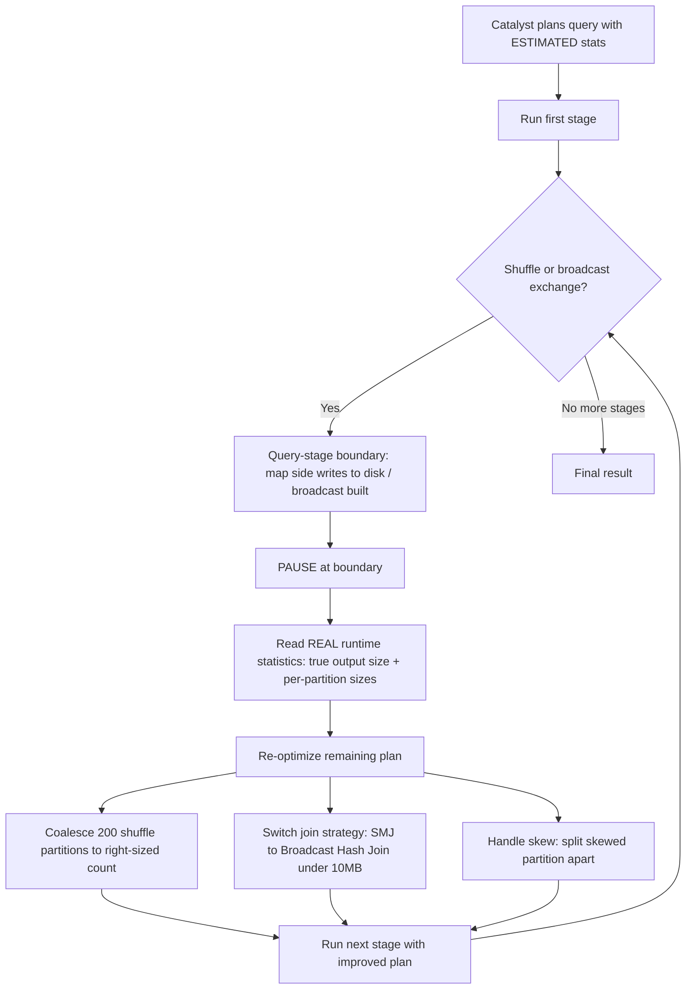

Here's how I'd say it back. A normal Spark query gets planned ONCE at the start, and the planner is guessing at data sizes with a cost model. AQE (new in Spark 3.0) refuses to commit to those guesses. The trick is the query-stage boundary. A shuffle or broadcast exchange splits the plan into stages, and because the map side of a shuffle has to fully finish and write to disk before the reduce side reads, there's a forced pause there. That pause is a checkpoint where Spark can peek at the shuffle output that was really written and get REAL statistics — actual total size, actual per-partition sizes — instead of estimates. Then it re-optimizes the rest of the plan before running it. With the real numbers it can: coalesce the dumb fixed 200 shuffle partitions down to a sensible number if the data is small; flip a Sort Merge Join into a Broadcast Hash Join if a side really came in under the 10MB broadcast threshold; and split a skewed partition apart so one monster task doesn't OOM. So the whole idea is: the exchange boundary buys a pause, the pause buys real statistics, and real statistics buy a smarter plan for the part that hasn't run yet.

*Source: [[adaptive-query-execution]] (vutr)*
