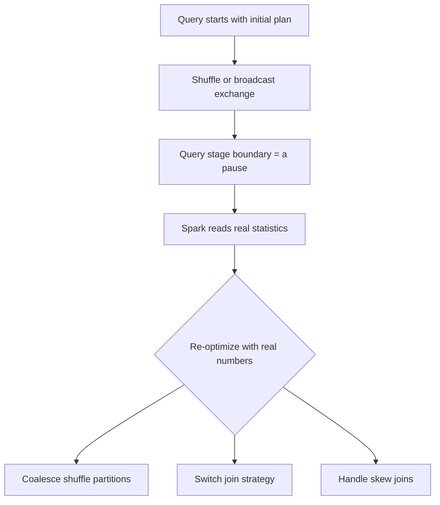

So basically AQE (new in Spark 3.0) lets Spark rewrite its own plan mid-query. It can merge shuffle partitions, swap which join method it uses, and deal with lopsided skew joins. And it can only do this because a shuffle or broadcast creates a pause point (a query stage boundary), and that pause is where Spark checks the real data stats and fixes its plan.

*Source: [[adaptive-query-execution]] (vutr)*
