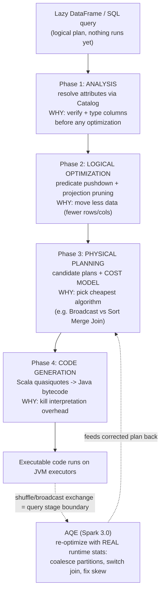

Let me walk the whole pipeline to prove I get it. I start with a lazy DataFrame -- it's just a logical plan, nothing runs until an action fires. (1) ANALYSIS: Spark has names I typed but hasn't verified them, so it uses the Catalog to resolve attributes -- bind each column name to a real, typed column and fail early if it's fake. You can't optimize what you haven't verified. (2) LOGICAL OPTIMIZATION: with a valid plan, Catalyst rewrites it cheaper -- predicate pushdown shoves my WHERE filters down to the data source so I read fewer rows, and projection pruning drops columns I never use. It's reshaping WHAT to compute to move less data. (3) PHYSICAL PLANNING: one logical plan has many physical realizations (which join algorithm, how to move data), so Catalyst generates candidates and a cost model picks the cheapest -- that's how a sub-10MB table gets a broadcast join instead of a shuffle. This decides HOW. (4) CODE GENERATION: rather than interpret the plan row by row, Catalyst emits specialized Java via Scala quasiquotes, compiled to JVM bytecode, killing interpretation overhead -- fast, but harder to debug, which is literally why Photon went interpreted-C++ instead. The through-line: Analysis makes it CORRECT and typed, Logical makes it move LESS data, Physical picks the cheapest ALGORITHM, Code Gen makes the execution itself FAST. And because all that planning uses estimates, AQE later re-optimizes at shuffle boundaries with real numbers.

*Source: [[catalyst-optimizer]] (vutr)*
