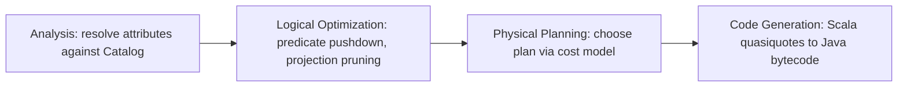

So Catalyst is like a translator plus editor: I tell it what answer I want, and it figures out the smartest, fastest way to actually get it. It goes in four steps: first it figures out what my column names mean (Analysis), then it trims the query to be efficient (Logical Optimization), then it uses a cost model to pick the best real plan (Physical Planning), and finally it writes that plan into actual runnable Java code (Code Generation).

*Source: [[catalyst-optimizer]] (vutr)*
