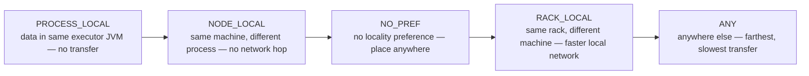

Data sits in partitions across the cluster and tasks need to run near their data because moving code is cheap but moving data is expensive. The scheduler places each task at the closest locality it can get: PROCESS_LOCAL (data in the same executor process, no transfer), then NODE_LOCAL (same machine, different process, no network hop), then NO_PREF (no preference, place anywhere), then RACK_LOCAL (different machine but same rack, faster local network), then ANY (anywhere else, farthest and slowest). Nearer wins because each step out means shipping data over slower links. And if one task lags (a straggler), speculative execution launches a duplicate on another executor and takes whichever finishes first.

*Source: [[data-locality]] (vutr)*
