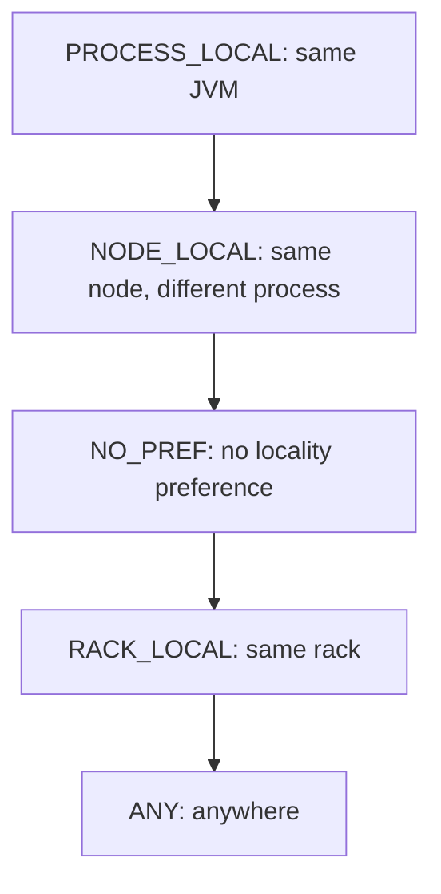

Alex: So Spark would rather run the work where the data already is than move the data, because moving data is expensive. It has a ranked wishlist of how close the data is, from same-process (PROCESS_LOCAL) all the way down to anywhere (ANY), and it waits a moment for a good spot before dropping to a worse one. And separately, if a task is dragging, Spark runs a second copy elsewhere and takes the faster one so a single slow machine doesn't hold everything up. That preferred spot comes from the RDD's fifth property.

*Source: [[data-locality]] (vutr)*
