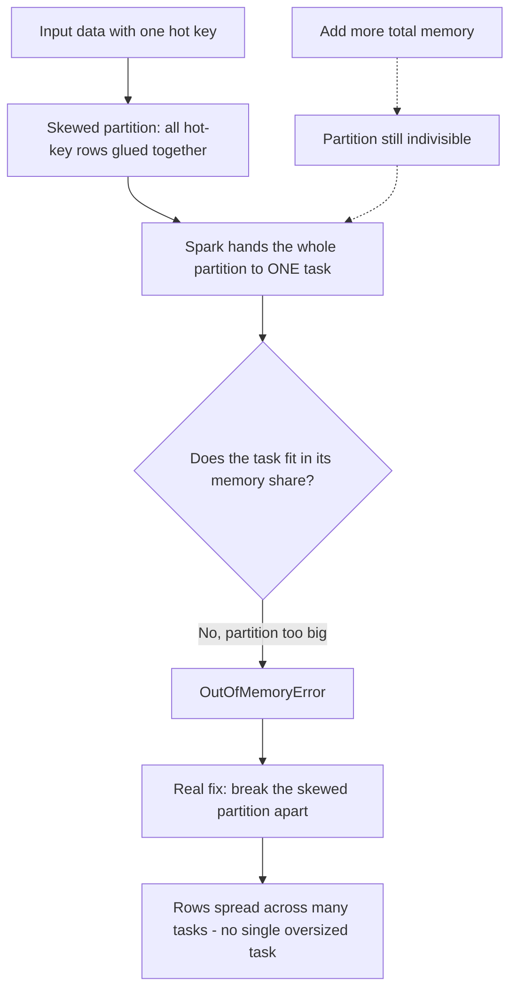

Let me say it back the way it clicked for me. A partition is one chunk of data that Spark gives to exactly ONE task. Skew means one key hogs a huge partition. Here's the WHY that memory can't fix it: memory is a shared pool, but the skewed partition is indivisible — it's still one lump handed to one task. When I add memory, I'm making the whole pool bigger, but I haven't split the lump, so the lump still goes to one task, and if the lump is bigger than what one task can hold, it dies anyway. It's like a 300-pound suitcase at an airport with a 50-pound-per-bag limit: buying a bigger plane (more total memory) doesn't help because one person still has to lift that one bag. The only fix is repacking it into several bags — breaking the partition apart so the weight spreads across tasks. And the Monday-vs-Thursday thing isn't the data being different — it's that Spark schedules tasks in a different order each run, so sometimes the heavy tasks pile onto the same executor at the same time (crash) and sometimes they don't (survives). Same suitcase, different luck on which bags hit the belt together.

*Source: [[data-skew-oom]] (vutr)*
