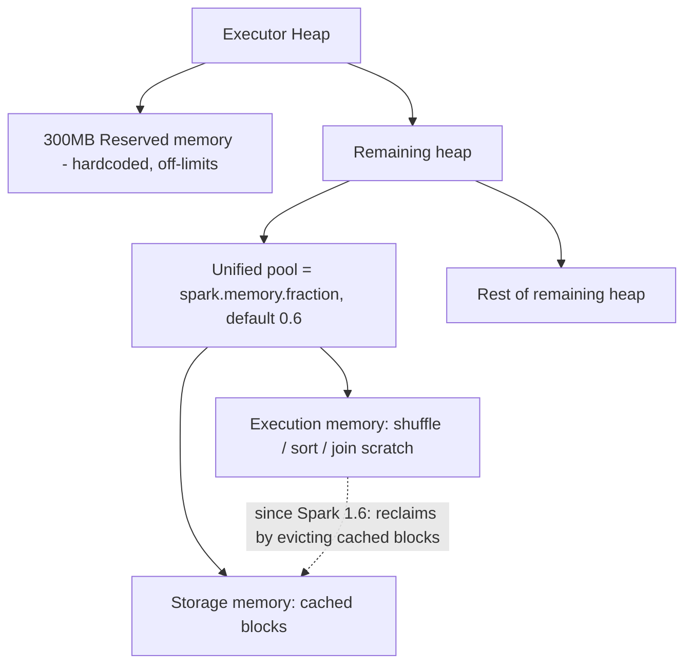

So let me say it back: an executor's heap has three parts — a fixed 300MB reserved chunk that's off-limits, then 60% (by default) of what's left is a shared 'unified' pool, and the rest is other stuff. The unified pool is used by both execution and storage, and since Spark 1.6 execution can steal from storage by evicting cached blocks when it needs to. That's why adding more tasks without adding more memory can starve them — the pool doesn't grow, it just gets split thinner. Did I get the reclaim part right?

*Source: [[executor-memory-model]] (vutr)*
