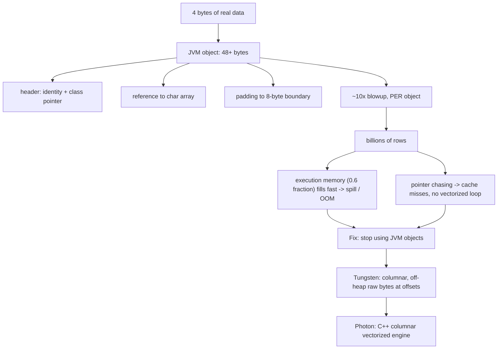

Alex: Okay, let me say it back the way I actually get it now. The trick is separating the DATA from the BOX it comes in. My real data is 4 bytes. But a JVM object isn't just the data — it's the data plus a header (identity bits + a pointer to what class it is), plus a pointer to the actual char array, plus padding to round up to 8 bytes. All that packaging is 48+ bytes, so ~90% of what I'm storing is box, not content — a 10x blowup. And the key thing that made it click: this isn't once, it's PER object, and Spark does billions of rows, so I'm paying the tax billions of times. Two things break because of that. First, memory: Spark's execution memory is a fixed budget (that 0.6 fraction after the 300MB reserved), so if headers eat it, way fewer real rows fit before Spark has to spill to disk or throw OOM. Second, speed: every pointer means the CPU jumps to a random spot in memory to find the value, which misses the cache and kills fast looping. So the fix isn't 'buy more RAM' — the fix is stop using JVM objects. Store the values as raw packed bytes off-heap in columns (Tungsten), where a value is just bytes at an offset — no header, no pointer, no padding. Photon does the same in C++ with a columnar layout instead of Spark's row layout. So the 10x overhead is literally the REASON columnar off-heap execution exists — it's the tax they built the engine to dodge.

*Source: [[jvm-object-overhead]] (vutr)*
