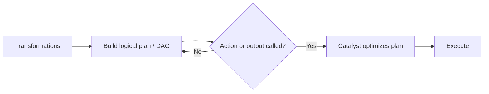

So Spark waits. My transformations just add steps to a plan (a DAG), and nothing runs until I ask for a result with an action or output. A Spark DataFrame is a recipe, not the cooked meal, unlike Pandas which cooks immediately. And waiting is good because Catalyst can improve the whole recipe before Spark runs it.

*Source: [[lazy-evaluation]] (vutr)*
