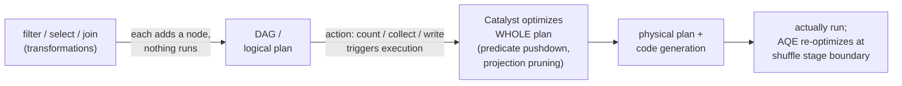

Here is how I would say it back. When I write filter, select, join and so on, Spark does not actually run any of them. Those are transformations, and they are lazy - each one just adds a node to a DAG, a dependency graph of steps with no cycles (line 4). My code is really building a logical plan, not a result (line 26). The plan just sits there. Only when I call an action - count, collect, or write to disk, the 'special output operation' from line 26 - does Spark finally trigger execution of the whole DAG (line 4). The payoff of waiting: because Spark holds the entire plan before running it, the Catalyst optimizer (line 5) can rewrite the whole thing first. In its Logical Optimization phase it does predicate pushdown (shove filters down early so fewer rows get read) and projection pruning (throw away columns nobody uses). Those global rewrites are only possible because nothing ran yet - if each transformation executed on the spot, it would be too late to move a later filter earlier. So the mechanism is: lazy transformations build the DAG -> action triggers -> Catalyst optimizes the full plan -> then it runs. Laziness is not slowness; it is Spark buying itself the chance to be smart about the whole job at once.

*Source: [[lazy-evaluation]] (vutr)*
