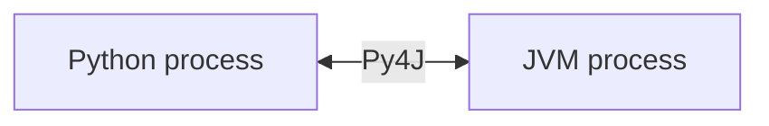

Alex: Let me try to say it back. PySpark isn't really Python doing the work, it's a wrapper. When I run it, two programs start up together, a Python one and a JVM (Java) one, and they chat through Py4J. If I write my own function in Python (a UDF), it's slow because the data has to be packed up and shipped between the two, that's serialization, and it doesn't get the Catalyst or Tungsten speed boosts. But they added faster versions: Pandas/vectorized UDFs in 2.3 and Arrow-optimized ones in 3.5, plus Spark Connect in 3.4 that splits the client off using gRPC/protobuf.

*Source: [[pyspark]] (vutr)*
