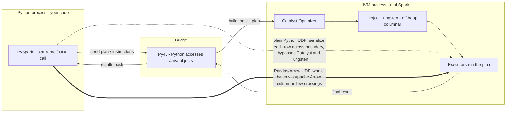

Okay let me say it back the way it actually clicked. PySpark is a wrapper — TWO processes, a Python one (my code) and a JVM one (real Spark), and Py4J is the bridge letting Python poke Java objects. For normal DataFrame stuff my Python is just a remote control: it ships instructions over Py4J, the JVM does the work with Catalyst and Tungsten, so it's basically as fast as Scala. The trap is Python UDFs. The JVM can't run Python, so for my custom function it has to serialize each row, ship it to Python, Python deserializes it, runs my code, serializes the answer, ships it back — a full round trip across the boundary. Plus Catalyst treats my UDF as a black box it can't optimize through, and my data balloons from compact Tungsten bytes into fat objects (that 4-byte string -> 48+ bytes point). Three taxes: serialization, lost optimization, object bloat = slow. The fix isn't 'make Python fast,' it's 'stop crossing the boundary so often.' Pandas UDFs (2.3) send a whole BATCH at once via Apache Arrow — a columnar format both sides share so almost no re-serialization — and I process the vector with Pandas/NumPy C code, one crossing per batch instead of per row. Arrow-optimized UDFs (3.5) bolt that Arrow transport onto regular Python UDFs too. And Spark Connect (3.4) swaps the local Py4J glue for a gRPC/protobuf client-server link so a thin client sends the plan to a remote cluster. The mechanism I'm proudest of grasping: the overhead is per-crossing, so vectorization wins by amortizing one fixed boundary cost over many rows.

*Source: [[pyspark]] (vutr)*
