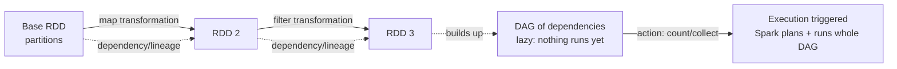

Let me rebuild it as mechanism, not a list. An RDD is 'distributed' because property 1 splits it into partitions across machines, and 'resilient' because properties 2 and 3 together — a per-partition compute function plus a dependency list — mean Spark stored a RECIPE and a parent pointer, so a lost partition is just recomputed from its lineage instead of being lost forever. The partitioner (4) and preferred locations (5) are both optimizations: one avoids reshuffling keys you've already laid out, the other schedules compute onto the node where the data already sits so you don't ship data over the network. The reason lineage is even safe to rely on is immutability: since a parent RDD can never be mutated in place, its recipe stays valid forever, so recomputation always reproduces the same thing. Laziness is the second gear — a transformation like map doesn't run; it just adds a node to a DAG recording 'this new RDD depends on that old one via this function.' The DAG keeps growing silently until an ACTION (count, collect) fires, and THAT is what triggers execution — Spark finally reads the whole DAG and runs it. The payoff of waiting is that Spark sees the entire operation chain at once and can plan/optimize across it instead of materializing each step blindly. And the deepest 'why': Spark was born in 2009 to beat MapReduce on iterative ML, where you sweep the same data every loop. MapReduce hit disk each pass; an RDD you keep in memory and reuse skips that disk cost on every later pass — so in-memory reuse isn't a nice-to-have, it's the founding motivation and the source of the 'in-memory' name.

*Source: [[rdd]] (vutr)*
