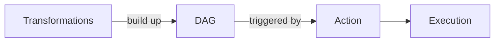

So an RDD is Spark's most basic piece of data, and I can fully describe one with five things — its partitions (the pieces), a function to compute each piece, its dependencies (what it came from), an optional partitioner just for key-value ones, and optional preferred locations. It never changes once created. And it's lazy: transformations just stack up a DAG plan, and only an action makes Spark actually run everything.

*Source: [[rdd]] (vutr)*
