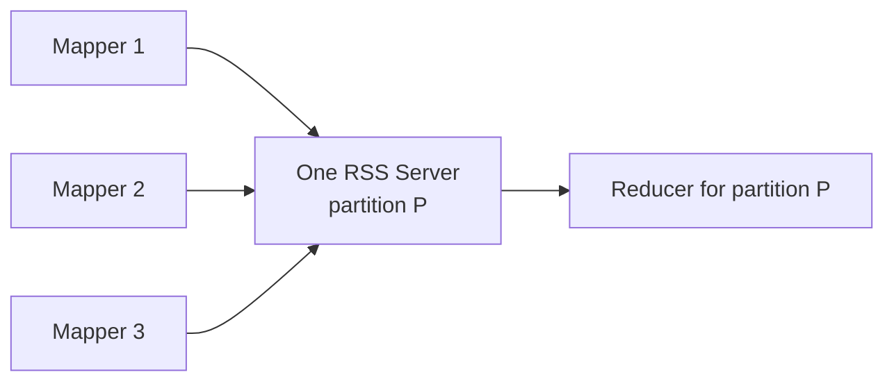

So let me play it back: regular Spark shuffle is 'reducer, go collect your partition's pieces from all these different mappers' — lots of tiny writes on the mapper side and lots of fragile fetches on the reducer side. Uber flips it: every mapper sends same-partition data to ONE RSS server, so a partition lives in one place, and the reducer just grabs it from that single server. Fewer, bigger writes = less SSD churn (3 months to ~3 years of life), and one fetch target instead of many = 95% fewer shuffle failures. The 'aha' is that it's not a new disk or more memory — it's re-routing WHERE the writes land so the disk sees a calmer, more consolidated write pattern.

*Source: [[remote-shuffle-service]] (vutr)*
