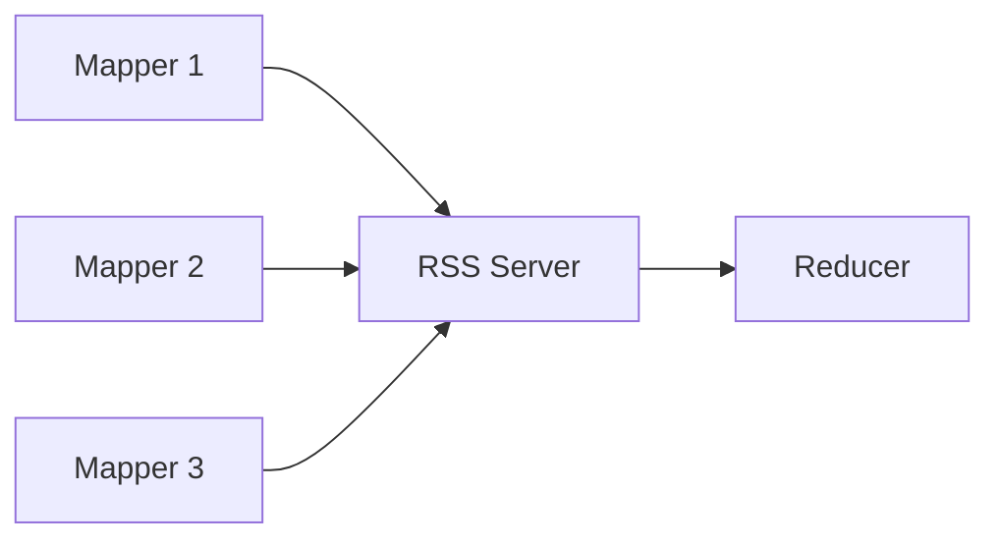

Alex: So normally the reducers have to grab their matching data from tons of different mappers, which is messy and wears out the disks fast. Uber's RSS reverses it: every mapper dumps its same-partition data onto one RSS server, so each reducer just picks it up from that single spot. And that made the disks last way longer (3 months to ~3 years) and cut shuffle failures by 95 percent.

*Source: [[remote-shuffle-service]] (vutr)*
