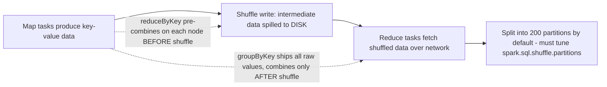

So the shuffle is Spark's step for regrouping data by key across the cluster — and here's the trap: even though Spark is sold as 'in-memory,' the shuffle actually WRITES to disk, because the map side has to dump its intermediate results somewhere durable for the reduce side to fetch. On top of that, Spark always cuts the shuffled data into 200 partitions by default no matter how big the data is, so you have to tune spark.sql.shuffle.partitions to fit your actual size. And reduceByKey beats groupByKey because it shrinks the data on each node BEFORE the shuffle, so there's less to write to disk and less to send over the wire — groupByKey shuffles everything raw and only combines afterward.

*Source: [[shuffle-writes-to-disk]] (vutr)*
