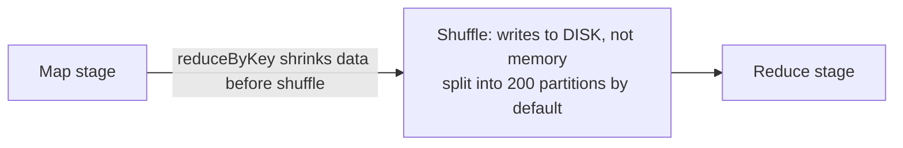

Alex: So even though Spark is famous for being in-memory, the shuffle step actually writes to disk. And the default is 200 shuffle partitions no matter the data size, so I should tune that. And reduceByKey is better than groupByKey because it cuts the data down before the shuffle instead of after.

*Source: [[shuffle-writes-to-disk]] (vutr)*
