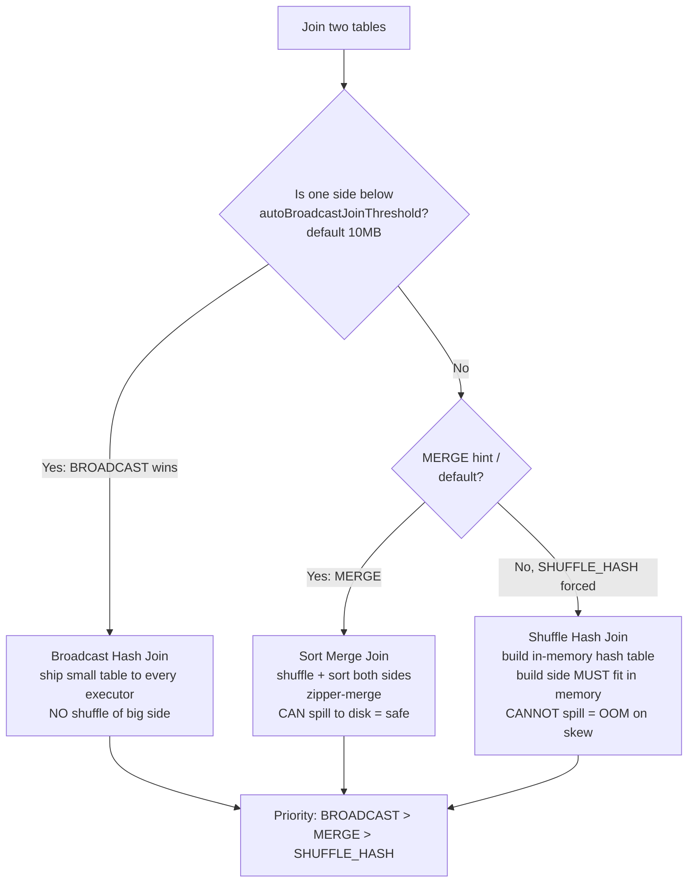

SMJ = shuffle both sides, sort each partition, zipper-merge the two sorted runs. It's the safe default because a sort can SPILL TO DISK, so a partition bigger than memory just gets slower, not fatal. SHJ builds an in-memory hash table on the small side and streams the big side through it — faster, but the build side MUST fit in memory, so a skewed partition throws OOM (no on-disk hash table exists). BHJ skips shuffling entirely by copying a <10MB table to every executor. Bucket join skips the shuffle by pre-partitioning at write time. Hint order BROADCAST > MERGE > SHUFFLE_HASH ranks them fastest-when-applicable down to the fragile fallback.

*Source: [[sort-merge-join]] (vutr)*
