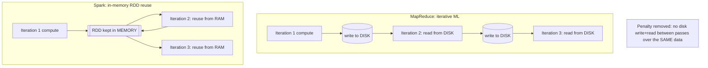

Okay, let me say it back in mechanism terms, not just 'Spark is faster.' The core pain was that MapReduce, for an algorithm that loops over the same data many times (like training an ML model), dumped each round's results to DISK and then the next round had to read them back from disk. So every iteration ate a write-to-disk AND a read-from-disk, on data you literally already had in hand. Spark's fix is to hold that dataset in memory as an RDD and REUSE it across iterations — so the next pass reads from RAM instead of paying the disk round-trip. The disk write-between-iterations was the bottleneck; keeping the RDD resident in memory is what removes it. And an RDD isn't magic storage — it's immutable and lazy: transformations just build up a DAG plan, and only an action actually kicks off the compute.

*Source: [[spark-origin]] (vutr)*
