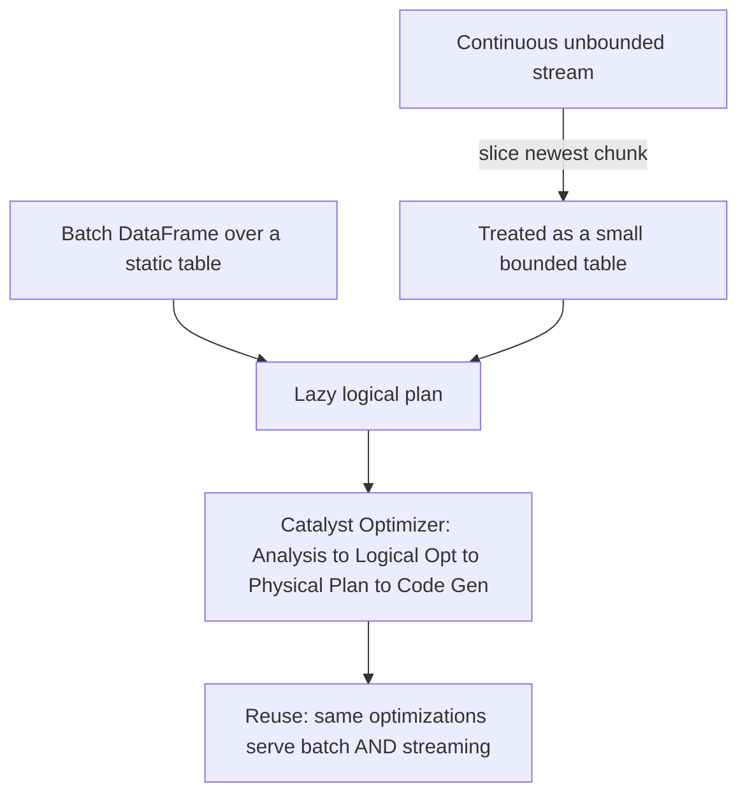

Okay here is how I would say it to a friend. A stream is data that never stops. Spark's SQL engine was built to crunch finite tables. Instead of building a whole new engine for endless data, Spark pretends the stream is a bunch of tiny finite tables arriving one after another, and runs its normal table-crunching on each one forever. The clever bit that makes this actually pay off: in Spark a DataFrame isn't the data, it's a lazy plan of what to compute, and that plan gets fed to the Catalyst optimizer. Because the streaming query is written the same way as a batch query, it turns into the same plan, so the same optimizer squeezes it. So Spark gets to reuse ALL its batch optimizations on streams without rewriting them. That's why the 'a stream is just bounded data' idea is a big deal, it's not a philosophy thing, it's engineering reuse.

*Source: [[spark-structured-streaming]] (vutr)*
